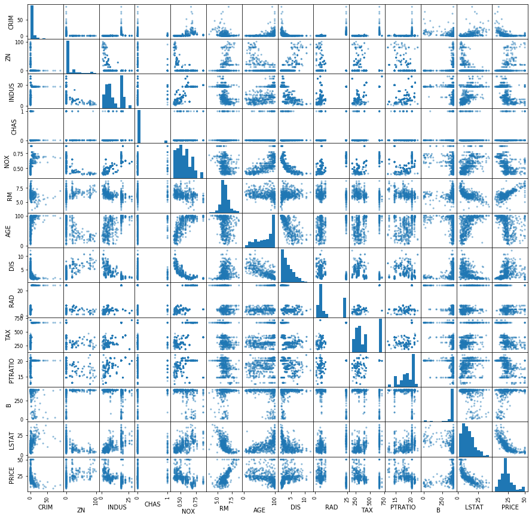

## 単回帰分析

anscombeデータセットを用いた、単回帰分析を行う。

```python
import seaborn as sns
anscombe = sns.load_dataset('anscombe')
print(anscombe)
```

出力の一部は下記のとおり。

```
   dataset     x      y
0        I  10.0   8.04
1        I   8.0   6.95
2        I  13.0   7.58
3        I   9.0   8.81
4        I  11.0   8.33
5        I  14.0   9.96
6        I   6.0   7.24
7        I   4.0   4.26
8        I  12.0  10.84
9        I   7.0   4.82
10       I   5.0   5.68
11      II  10.0   9.14
```

anscombeデータセットは、4つのデータセットがまとまったものなので、ここではデータセットIを使用する。matplotlibを使用して散布図を描く。

```python
%matplotlib inline
from matplotlib import pyplot as plt

dataset1 = anscombe[anscombe['dataset'] == 'I']
plt.scatter(dataset1['x'], dataset1['y'])
```

![img](data:image/png;base64,iVBORw0KGgoAAAANSUhEUgAAAXAAAAD4CAYAAAD1jb0+AAAABHNCSVQICAgIfAhkiAAAAAlwSFlzAAALEgAACxIB0t1+/AAAADh0RVh0U29mdHdhcmUAbWF0cGxvdGxpYiB2ZXJzaW9uMy4xLjMsIGh0dHA6Ly9tYXRwbG90bGliLm9yZy+AADFEAAAPdElEQVR4nO3db2xk1X3G8eeJd6PMokYm2YHGJu1ChdxKpMRoFIWgorSEmrQIHNRIRI1EW9R9EyVppLjFihSkvkioHKmJVCnVCghIpds/W+OkjYpBoJQ3CdIsDvECcVGTQHZM2EGpoyiMhHF+feHxdtd41vbcO3Pn3Pl+3szM8fU9vyuWR+NzzznXESEAQHreUnQBAIDuEOAAkCgCHAASRYADQKIIcABI1IF+dnb48OE4cuRIP7sEgOSdPHny1Yiobm/va4AfOXJE9Xq9n10CQPJsv7hTO0MoAJCoXQPc9v22z9g+dU7bR20/a/uXtmu9LREAsJO9fAN/QNJN29pOSbpN0pN5FwQA2Jtdx8Aj4knbR7a1PS9JtntTFQBgVz0fA7d91Hbddr3ZbPa6OwAYGj0P8Ig4FhG1iKhVq2+aBQMA6FJfpxECGF4LSw3NLa5oda2lsdGKZqYmND05XnRZSSPAAfTcwlJDs/PLaq1vSJIaay3Nzi9LEiGewV6mER6X9G1JE7ZP277T9kdsn5Z0raRv2l7sdaEA0jW3uHI2vLe01jc0t7hSUEXlsJdZKB/r8KOHc64FQEmtrrX21Y69YSUmgJ4bG63sqx17Q4AD6LmZqQlVDo6c11Y5OKKZqYmCKioHbmIC6LmtG5XMQskXAQ6gL6YnxwnsnDGEAgCJIsABIFEEOAAkigAHgEQR4ACQKAIcABJFgANAoghwAEgUAQ4AiSLAASBRBDgAJIoAB4BEEeAAkCgCHAASRYADQKIIcABIFAEOAInaNcBt32/7jO1T57S9w/Zjtl9ov17c2zIBANvt5Rv4A5Ju2tZ2l6THI+JKSY+3PwMAzrGw1NB19zyhy+/6pq675wktLDVyPf+uAR4RT0r66bbmWyU92H7/oKTpXKsCgMQtLDU0O7+sxlpLIamx1tLs/HKuId7tGPilEfGyJLVfL+l0oO2jtuu2681ms8vuACAtc4sraq1vnNfWWt/Q3OJKbn30/CZmRByLiFpE1KrVaq+7A4CBsLrW2ld7N7oN8Fdsv0uS2q9ncqsIAEpgbLSyr/ZudBvg35B0R/v9HZK+nk85AFAOM1MTqhwcOa+tcnBEM1MTufVxYLcDbB+X9EFJh22flnS3pHsk/YvtOyW9JOmjuVUEACUwPTkuaXMsfHWtpbHRimamJs6258ERkdvJdlOr1aJer/etPwAoA9snI6K2vZ2VmACQKAIcABJFgANAoghwAEgUAQ4AiSLAASBRBDgAJIoAB4BEEeAAkCgCHAASRYADQKIIcABIFAEOAIkiwAEgUQQ4ACSKAAeARBHgAJAoAhwAEkWAA0CiCHAASBQBDgCJyhTgtj9t+5TtZ23/RV5FAQB213WA275K0p9Lep+kqyXdbPvKvAoDAFxYlm/gvyXpOxHxWkS8Iem/JH0kn7IAALvJEuCnJF1v+522D0n6A0nv3n6Q7aO267brzWYzQ3cAgHN1HeAR8bykv5H0mKRHJD0j6Y0djjsWEbWIqFWr1a4LBQCc70CWX46I+yTdJ0m2vyDpdB5FAf2ysNTQ3OKKVtdaGhutaGZqQtOT40WXBexJpgC3fUlEnLH9a5Juk3RtPmUBvbew1NDs/LJa6xuSpMZaS7Pzy5JEiCMJWeeB/5vt5yT9u6RPRMT/5lAT0Bdziytnw3tLa31Dc4srBVUE7E/WIZTfyasQoN9W11r7agcGDSsxMbTGRiv7agcGDQGOoTUzNaHKwZHz2ioHRzQzNVFQRcD+ZBpCAVK2daOSWShIFQGOoTY9OU5gI1kMoQBAoghwAEgUAQ4AiSLAASBRBDgAJIoAB4BEEeAAkCjmgQNDhi10y4MAB4YIW+iWC0MowBBhC91yIcCBIcIWuuVCgANDhC10y4UAB4YIW+iWCzcxgSHCFrrlQoADQ4YtdMuDAAcKwnxsZJVpDNz2Z2w/a/uU7eO235ZXYUCZbc3Hbqy1FPr/+dgLS42iS0NCug5w2+OSPiWpFhFXSRqRdHtehQFlxnxs5CHrLJQDkiq2D0g6JGk1e0lA+TEfG3noOsAjoiHpS5JekvSypJ9FxKN5FQaUGfOxkYcsQygXS7pV0uWSxiRdZPvjOxx31Hbddr3ZbHZfKVAizMdGHrIMoXxI0g8johkR65LmJX1g+0ERcSwiahFRq1arGboDymN6clxfvO09Gh+tyJLGRyv64m3vYRYK9iXLNMKXJL3f9iFJLUk3SKrnUhUwBJiPjayyjIE/JemEpKclLbfPdSynugAAu8i0kCci7pZ0d061AAD2gc2sACBRBDgAJIoAB4BEEeAAkCh2IwRQemXd+ZEAB1BqWzs/bm0etrXzo6TkQ5whFAClVuadHwlwAKVW5p0fCXAApVbmnR8JcAClVuadH7mJCaDUtm5UMgsFABJU1p0fGUIBgEQR4ACQKIZQBlBZV40ByBcBPmDKvGoMQL4YQhkwZV41BiBfBPiAKfOqMQD5IsAHTJlXjQHIFwE+YMq8agxAvriJOWDKvGoMQL66DnDbE5L++ZymKyR9PiK+nLmqIVfWVWMA8tV1gEfEiqT3SpLtEUkNSQ/nVBcAYBd5DaHcIOl/IuLFnM6HIcPiJWD/8grw2yUdz+lcGDIsXgK6k3kWiu23SrpF0r92+PlR23Xb9WazmbU7lBCLl4Du5DGN8MOSno6IV3b6YUQci4haRNSq1WoO3aFsWLwEdCePAP+YGD5BBixeArqTKcBtH5J0o6T5fMrBMGLxEtCdTDcxI+I1Se/MqRYMKRYvAd1hJSYGAouXgP1jLxQASBQBDgCJIsABIFEEOAAkigAHgEQR4ACQKAIcABJFgANAoghwAEgUAQ4AiSLAASBRBDgAJIoAB4BEEeAAkCgCHAASRYADQKIIcABIFAEOAIkiwAEgUQQ4ACQqU4DbHrV9wvb3bT9v+9q8CgMAXFjWp9J/RdIjEfFHtt8q6VAONQEA9qDrALf9dknXS/oTSYqI1yW9nk9ZAIDdZBlCuUJSU9LXbC/Zvtf2RdsPsn3Udt12vdlsZugOAHCuLAF+QNI1kr4aEZOSfiHpru0HRcSxiKhFRK1arWboDgBwriwBflrS6Yh4qv35hDYDHQDQB10HeET8RNKPbU+0m26Q9FwuVQEAdpV1FsonJT3UnoHyA0l/mr0kAMBeZArwiPiupFpOtQAA9oGVmACQqKxDKKW2sNTQ3OKKVtdaGhutaGZqQtOT40WXBQCSCPCOFpYamp1fVmt9Q5LUWGtpdn5ZkghxAAOBIZQO5hZXzob3ltb6huYWVwqqCADOR4B3sLrW2lc7APQbAd7B2GhlX+0A0G8EeAczUxOqHBw5r61ycEQzUxMdfgMA+oubmB1s3ahkFgqAQUWAX8D05DiBDWBgMYQCAIkiwAEgUQQ4ACSKAAeARBHgAJAoAhwAEkWAA0CiCHAASBQBDgCJIsABIFEEOAAkigAHgERl2szK9o8k/VzShqQ3IoIn1ANAn+SxG+HvRsSrOZwHALAPDKEAQKKyBnhIetT2SdtHdzrA9lHbddv1ZrOZsTsAwJasAX5dRFwj6cOSPmH7+u0HRMSxiKhFRK1arWbsDgCwJVOAR8Rq+/WMpIclvS+PogAAu+v6JqbtiyS9JSJ+3n7/+5L+OrfKUIiFpQbPAQUSkWUWyqWSHra9dZ5/jIhHcqkKhVhYamh2flmt9Q1JUmOtpdn5ZUkixIEB1HWAR8QPJF2dYy0o2Nziytnw3tJa39Dc4goBDgwgphHirNW11r7aARSLAMdZY6OVfbUDKBYBjrNmpiZUOThyXlvl4IhmpiYKqgjAheSxlB4lsTXOzSwUIA0EOM4zPTlOYAOJYAgFABJFgANAoghwAEgUAQ4AiSLAASBRBDgAJIoAB4BEEeAAkCgCHAASNfArMXnAAADsbKADnAcMAEBnAz2EcqEHDADAsBvoAOcBAwDQ2UAHOA8YAIDOBjrAecAAAHQ20DcxecAAAHSWOcBtj0iqS2pExM3ZSzofDxgAgJ3lMYTyaUnP53AeAMA+ZApw25dJ+kNJ9+ZTDgBgr7J+A/+ypL+U9MtOB9g+artuu95sNjN2BwDY0nWA275Z0pmIOHmh4yLiWETUIqJWrVa77Q4AsE2Wb+DXSbrF9o8k/ZOk37P9D7lUBQDYlSMi+0nsD0r67G6zUGw3Jb3YZTeHJb3a5e+mimseDsN2zcN2vVL2a/71iHjTEEZf54HvVMBe2a5HRC3PegYd1zwchu2ah+16pd5dcy4BHhHfkvStPM4FANibgV5KDwDoLKUAP1Z0AQXgmofDsF3zsF2v1KNrzuUmJgCg/1L6Bg4AOAcBDgCJSibAbY/YXrL9H0XX0g+2R22fsP1928/bvrbomnrJ9mdsP2v7lO3jtt9WdE15s32/7TO2T53T9g7bj9l+of16cZE15q3DNc+1/11/z/bDtkeLrDFvO13zOT/7rO2wfTiPvpIJcA3frodfkfRIRPympKtV4mu3PS7pU5JqEXGVpBFJtxdbVU88IOmmbW13SXo8Iq6U9Hj7c5k8oDdf82OSroqI35b035Jm+11Ujz2gN1+zbL9b0o2SXsqroyQCfNh2PbT9dknXS7pPkiLi9YhYK7aqnjsgqWL7gKRDklYLrid3EfGkpJ9ua75V0oPt9w9Kmu5rUT220zVHxKMR8Ub743ckXdb3wnqow39nSfpbbW7+l9vMkSQCXHvY9bBkrpDUlPS19rDRvbYvKrqoXomIhqQvafObycuSfhYRjxZbVd9cGhEvS1L79ZKC6+m3P5P0n0UX0Wu2b9HmQ2+eyfO8Ax/ge931sGQOSLpG0lcjYlLSL1S+P63Pao/73irpckljki6y/fFiq0Kv2f6cpDckPVR0Lb1k+5Ckz0n6fN7nHvgA13Duenha0umIeKr9+YQ2A72sPiTphxHRjIh1SfOSPlBwTf3yiu13SVL79UzB9fSF7Tsk3Szpj6P8i1F+Q5tfTp5p59hlkp62/atZTzzwAR4RsxFxWUQc0eaNrSciotTfziLiJ5J+bHui3XSDpOcKLKnXXpL0ftuHbFub11vam7bbfEPSHe33d0j6eoG19IXtmyT9laRbIuK1ouvptYhYjohLIuJIO8dOS7qm/f95JgMf4EPsk5Iesv09Se+V9IWC6+mZ9l8aJyQ9LWlZm/8uS7fc2vZxSd+WNGH7tO07Jd0j6UbbL2hzhsI9RdaYtw7X/HeSfkXSY7a/a/vvCy0yZx2uuTd9lf+vFwAoJ76BA0CiCHAASBQBDgCJIsABIFEEOAAkigAHgEQR4ACQqP8D23nahEdnrg4AAAAASUVORK5CYII=)

$x$が増加すると$y$も増加するという正の相関が見える。  
さらに、直線関係も見えるため（線形）、$y=ax+b$という一次式をあてはめ、係数$a$と切片$b$を求める。  
$x$の値が分かれば$y$の値を予測することができるようになる。
上記の一次式で求めた値が予測値であることを示すため、$\hat{y}$のように表現する。

$\hat{y}$は予測値、実際に測定した$y$を実測値とすると、$\epsilon=y-\hat{y}$で求めた実測値と予測値の差$\epsilon$を求めることができる。これを残差という。  
残差は正負どちらの値を取ることもあるため、$\epsilon^2$のように二乗した上で、データセットのすべての値についての残差を合計した残差平方和（residual sum of squares）を求める。
$$
Q = \sum_{i=1}^{n}\epsilon_i^2 = \sum_{i=1}^{n}(y_i-(ax_i+b))^2
$$
$Q$を最小にする$a$と$b$を求めるために、最小二乗法を用いることができる。

scikit-learnでは、最小二乗法を用いた線形回帰分析を下記のように行う。

```python
from sklearn import linear_model

x = dataset1['x'].values # numpy.ndarrayに変換
x = x.reshape(-1, 1) # 2次元データに変換、-1はデータに沿って値を決めることを示す
y = dataset1['y'].values
y = y.reshape(-1, 1)

# 線形回帰
model = linear_model.LinearRegression()
model.fit(x, y)
```

係数$a$と、切片$b$は、下記のようになる。

```python
print('係数: %s' % model.coef_)
print('切片: %s' % model.intercept_)
```

```
係数: [[0.50009091]]
切片: [3.00009091]
```

つまり、下記の回帰式が得られたことになる。
$$
y = 0.5001x+3.0001
$$
先ほどの実測値の散布図に、回帰式の直線を描くと下図のようになる。

```python
plt.scatter(x, y)

x_for_pred = list(range(15))
y_pred = []
for x_temp in x_for_pred:
    y_pred.append(model.coef_[0][0] * x_temp + model.intercept_[0])

plt.plot(x_for_pred, y_pred, color='red')
plt.show()
```

![img](data:image/png;base64,iVBORw0KGgoAAAANSUhEUgAAAXAAAAD4CAYAAAD1jb0+AAAABHNCSVQICAgIfAhkiAAAAAlwSFlzAAALEgAACxIB0t1+/AAAADh0RVh0U29mdHdhcmUAbWF0cGxvdGxpYiB2ZXJzaW9uMy4xLjMsIGh0dHA6Ly9tYXRwbG90bGliLm9yZy+AADFEAAAgAElEQVR4nO3deXRV5dnG4d8jQxscihW0gqXYqlFRAY0jxSqo4FAmbat1tpWKVhwQBVEsjkjE2aqoVSqKnwOD1mqkoOKIBMKMiIIiAUtEowgRQni+P95gGRIIOTvZZ5/c11osks0h+14suNl5zzuYuyMiIsmzXdwBRESkelTgIiIJpQIXEUkoFbiISEKpwEVEEqp+bd6sSZMm3rJly9q8pYhI4k2ZMuVLd2+66fVaLfCWLVuSn59fm7cUEUk8M/usousaQhERSaitFriZ/cPMlpnZrA2u/c7MZpvZOjPLqdmIIiJSkao8gT8BdN7k2iygBzAx6kAiIlI1Wx0Dd/eJZtZyk2tzAcysZlKJiMhWaQxcRCSharzAzaynmeWbWX5RUVFN305EpM6o8WmE7j4MGAaQk5OjrQ9FJCVjCgrJzZvHkuISmjXOom+nbLq1bR53rFjU6jxwEZFUjCkopP+omZSUlgFQWFxC/1EzAepkiVdlGuFI4D0g28wWm9mfzKy7mS0GjgReNrO8mg4qIpKbN++H8l6vpLSM3Lx5MSWKV1VmoZxRyS+NjjiLiMgWLSku2abrmU6zUEQkMZo1ztqm65lOBS4iidG3UzZZDeptdC2rQT36dsqOKVG89CamiCTG+jcqNQslUIGLSKJ0a9u8zhb2pjSEIiKSUCpwEZGEUoGLiCSUClxEJKFU4CIiCaUCFxFJKBW4iEhCqcBFRBJKBS4iklAqcBGRhFKBi4gklApcRCShVOAiIglVlSPV/mFmy8xs1gbXfmpm48xsfvnPO9dsTBER2VRVnsCfADpvcq0fMN7d9wbGl38uIiIbGFNQSLvBE/h1r3/QbvAExhQURvr1t1rg7j4R+GqTy12B4eUfDwe6RZpKRCThxhQU8vdH87jhHwP4z6O9sM8+pf+omZGWeHUPdNjN3ZcCuPtSM9u1sheaWU+gJ0CLFi2qeTsRkQRZsYIVV/TlpbefY+129bmn3RkUbb8zq0vLyM2bF9mBFDV+Io+7DwOGAeTk5HhN309EJDbr1sGIEdCvH2cvXcoLB3Tg9qPPZdmOu/zwkiXFJZHdrroF/l8z27386Xt3YFlkiUREkmjSJOjdGz74AA47jJ7druW1nfbc7GXNGmdFdsvqTiN8ETi3/ONzgbHRxBERSZglS+Ccc+CII2DRIhg+HN57j5Mu7E5Wg3obvTSrQT36dsqO7NZbfQI3s5HAMUATM1sM3AAMBp41sz8Bi4DfRZZIRCQJvv8e7roLbrkFSkuhXz+49lrYcUeAH8a5c/PmsaS4hGaNs+jbKTvSA5nNvfaGpXNycjw/P7/W7iciEjl3GDsW+vSBBQugWze44w741a9q7JZmNsXdcza9rpWYIiJVNWsWHH88dO8OWVkwbhyMHl2j5b0lKnARka356iu49FJo0wamToX77oNp0+C442KNVePTCEVEEmvtWnj4YRg4EIqLoVcvGDQIdtll67+3FqjARUQqMmECXHZZGDY59li45x448MC4U21EQygiIhtasAB69ICOHWHlShg1CsaPT7vyBhW4iEjw3XcwYADsvz+89lqYHjhnTnjD0izudBXSEIqI1G3r1sFTT8E118DSpXDWWTB4MDSPbr52TdETuIjUXR98AO3ahZWUe+wB774LTz6ZiPIGFbiI1EVLl8J558Hhh8PChfD44/D++3DkkXEn2yYaQhGRumP1arj7brj5ZlizJgybXHst7LRT3MmqRQUuIpnPHV58MSx//+QT6NIFhg6FvfaKO1lKNIQiIplt9mzo1CnsWdKwIeTlhb1MEl7eoAIXkUz19ddhf+7WrWHy5LAQZ/p0OOGEuJNFRkMoIpJZ1q6FRx6B668PJd6zJ9x0EzRpEneyyOkJXEQyx+uvwyGHwMUXwwEHhI2nHnwwI8sbVOAikgkWLoTTToMOHeCbb+C550KZt24dd7IalVKBm9llZjbLzGab2eVRhRIRqZKVK+G662C//eCVV8JQydy5oczTdPl7lKo9Bm5mBwAXAocBa4BXzexld58fVTgRkQq5w9NPh3nchYXwxz/C7beH1ZR1SCpP4PsB77v7KndfC7wJdI8mlohIJfLzw/L3s86C3XaDt98Oe5nUsfKG1Ap8FnC0me1iZo2Ak4Cfb/oiM+tpZvlmll9UVJTC7USkTvviC7jgAjj00LAY59FHw/TAdu3iThabahe4u88FbgfGAa8C04G1FbxumLvnuHtO06ZNqx1UROqo1ashNxf22QdGjICrroL58+FPf4Lt6vY8jJTmgbv7Y8BjAGZ2K7A4ilAiUrExBYXk5s1jSXEJzRpn0bdTNt3aJmPnvG3mDv/6F1x5JXz8MZxySlj+vs8+cSdLG6nOQtm1/OcWQA9gZBShRGRzYwoK6T9qJoXFJThQWFxC/1EzGVNQGHe06M2dCyeeGPYsqV8/zDB56SWV9yZS/f7jBTObA7wEXOLuX0eQSUQqkJs3j5LSso2ulZSWkZs3L6ZENeDrr+Hyy8PxZe+/D3fdBTNmQOfOcSdLS6kOobSPKoiIbNmS4pJtup4oZWXhTcnrroPly+HCC8OWr3rfbIvq9jsAIgnSrHHWNl1PjDffDMvfL7oonEc5dSo8/LDKuwpU4CIJ0bdTNlkN6m10LatBPfp2yo4pUYo++wx+/3s45pgwdPLss/DGG9CmTdzJEkO7EYokxPrZJomfhbJyJQwZEn6YwaBBYWpgo0ZxJ0scFbhIgnRr2zx5hb2eOzzzDFx9NSxeDKefHpa/t2gRd7LE0hCKiNS8KVOgffuwZ0nTpjBxIowcqfJOkQpcRGrOsmXw5z+H5e8ffRQOWpg8OZS5pExDKCISvTVr4L774MYbYdWqsJry+uvhJz+JO1lGUYGLSLT+/W+44orwxH3SSXDnnZCd0JkyaU5DKCISjQ8/DIV98skAvHfvcNq178Oej39Mu8ETMnPJf8xU4CKSmuJi6NMnLH9/5x0YOpSxT77KBct2rRv7tsRIBS4i1VNWFt6U3GefsGfJ+eeHbV6vvJIhExZm/r4taUBj4CKy7d56Cy67DAoK4Ne/hldfhYMP/uGXM3rfljSiJ3ARqbpFi8ICnKOPhi+/DAtzJk7cqLwhg/dtSTMqcBHZulWrwpL3ffeFsWPhhhvCm5Z/+EOFp79n3L4taUpDKCJSOfewyVTfvvD556GwhwzZ6grKjNm3Jc2pwEXquEqPaSsoCOPcb70VdggcMSIMnVRRovdtSYhUj1S7wsxmm9ksMxtpZj+OKpiI1LyKjmkb8uRbfNrjzLBH99y5YW/u/PxtKm+pHdV+Ajez5kBvYH93LzGzZ4HTgSciyiYiNWzDY9oalJVyztSXueydkTQq/T4cbTZwIDRuHHNKqUyqQyj1gSwzKwUaAUtSjyQitWX9tL7fLJjCwPGP8KuvFvPGnodwU8c/M/7Oi2JOJ1tT7QJ390IzuwNYBJQAr7n7a5u+zsx6Aj0BWmjrSJG0cnjpl1w49gE6fjKZBTs34/zTbuD1X+bQfGcdrpAEqQyh7Ax0BfYEioHnzOwsdx+x4evcfRgwDCAnJ8dTyCoiUfnmG7jpJp6+915WbVefm4+9gOGH/JbSeg003S9BUnkT8zhgobsXuXspMAo4KppYIlIjysrgscfC8vc772S7c8/hrZff5ZUTzmRtvQY0b5zFbT0O1OyRhEhlDHwRcISZNSIMoXQE8iNJJSLRe/vtMC1w6lRo1y5s+3rIIZwInHhc3OGkOqr9BO7uk4DnganAzPKvNSyiXCISlc8/D0eZtW8fTsh5+ukwt/uQQ+JOJilKaRaKu98A3BBRFhGJUkkJ5ObC4MFhReXAgeFA4e23jzuZREQrMUUyjTs8/zxcdVXYfOp3vwvL31u2jDuZREybWYlkkmnT4Jhj4Pe/h513hjfeCHuZqLwzkp7ARTJBUVE4NPiRR0JxP/RQOA2+Xr2t/14BtrAnTBpTgYskWWkpPPAA/O1v8N13cOmlYavXnXeOO1mirN8TZv22AuuPgAPSusQ1hCKSVHl5cNBB4QT4ww+HGTPg7rtV3tWw4Z4w6yXhCDgVuEjSzJ8PXbpA586wdi28+GI40mz//eNOllhJPQJOBS6SFN9+G6YBtmoV3pwcMgRmzYLf/rbCU3Gk6pJ6BJwKXCTdrVsHjz8elr/n5sJZZ8FHH4VTcn70o7jTZYSkHgGnNzFF0tm770Lv3jBlChx5JLz0Ehx6aNypMk5Sj4BTgYuko8WL4ZprwrL3Zs3CcWZ//KOGSmpQEo+AU4FLYiRxnu42KymBoUPhttvCzoEDBkC/frDDDnEnkzSkApdESOo83Spzh1GjwvL3Tz+FU08N49177hl3MkljehNTEiGp83SrZMYM6NABTjsNdtwRxo8Pe5movGUrVOCSCEmdp7tFX34JvXpB27ahxP/+97BXd4cOcSeThFCBSyIkdZ5uhUpL4d57Ye+9w94ll1wSFuf06gX1NaopVacCl0RI6jzdzbz2GrRuHU7GycmB6dNDmf/0p3EnkwSqdoGbWbaZTdvgx7dmdnmU4UTW69a2Obf1OJDmjbMwSN7ZjR9/DF27QqdOsHo1jBkTyrxVq7iTSYJV+/s1d58HtAEws3pAITA6olwim0nSPN31Ux6/+e9y+k19gT++O4rtftQwTA+84gqtoJRIRDXg1hH4xN0/i+jriSTWmIJCrn1hOicVjOPqN4ez68qvGX3QcWTlDqbzCTqHUqITVYGfDoys6BfMrCfQE6BFixYR3U4kff37kdE8PeZe2iydz7Td96Fnj+uY1iyb5lO/ofMJcaeTTJJygZtZQ6AL0L+iX3f3YZSfVp+Tk+Op3k8kbRUWQr9+DBsxgv/u8FOuOPlKxrQ6BrfwVlOipzxKWoriCfxEYKq7/zeCryWSPN9/D3feCbfeCqWl/POYM7i9TXdW/qjRRi9L5JRHSWtRTCM8g0qGT0QymjuMHh0OUhgwAI4/HubOZac7c1m3w44bvTSRUx4l7aX0BG5mjYDjgb9EE0ckIWbOhMsvhwkTwlTAcePguOMA6Fb+kozfeEtil1KBu/sqYJeIsoikv+XLw6HBDz4IP/kJ3H8//OUvm62gTNKUR0kurdsVqYq1a+Ghh2DgQPjmm7DsfdAg2EXPLxIfFbjI1owfH5a+z54dNpq6+2448MC4U4loLxSRSi1YAN27h7HtVavCft3/+Y/KW9KGClxkU999B9deC/vtF96cvPVWmDMnlLmONJM0oiEUkfXWrYOnngpnUS5dCmefHfYuaa43IyU9qcBFACZNCuPckybBYYeF4ZIjjog7lcgWaQhF6ralS+G880JZf/YZPPEEvPeeylsSQU/gUjd9/32YTXLLLbBmTRg2GTAgnEkpkhAqcKlb3OHFF+HKK8Msk65d4Y47YK+94k4mss00hCJ1x+zZ4UScbt3gxz8OJ+KMGaPylsRSgUvm++or6N07nEU5eXI4g3LatLD5lEiCaQhFMtfateHU9+uvh6+/DnuW3HgjNGkSdzKRSOgJXDLT66/DwQfDxReHlZMFBfD3v6u8JaOowCWzLFwIp54a9ixZsQJeeCFs+XrQQXEnE4mcClwyw3ffwXXXheXvr74KN98clr/36KHl75KxNAYuyeb+v+XvS5bAmWfC7bdr+bvUCSk9gZtZYzN73sw+NLO5ZnZkVMFEtmryZGjXLuxZ0qwZvPMOjBih8pY6I9UhlHuAV919X6A1MDf1SCJb8cUXcP75Yc+SBQvg8cfDHiZHHRV3MpFaVe0hFDPbCTgaOA/A3dcAa6KJJVKB1avhnnvgppvCx1dfHZa/77RT3MlEYpHKE/gvgSLgcTMrMLNHzWz7TV9kZj3NLN/M8ouKilK4ndRZ65e/t2oVxro7dAirKm+/XeUtdVoqBV4fOBh40N3bAiuBfpu+yN2HuXuOu+c0bdo0hdtJnTRnDnTuHPYsadgwzDAZOxb23jvuZCKxS6XAFwOL3X1S+efPEwpdJHVffw2XXx7mb0+aFHYOnD497GUiIkAKBe7uXwCfm1l2+aWOwJxIUkndVVYWTn/fe2+47z648EKYPz8cttCgQdzpRNJKqvPALwWeMrOGwALg/NQjSZ31xhuhqGfMgN/8Jjx1t2kTdyqRtJVSgbv7NCAnoiySIcYUFJKbN48lxSU0a5xF307ZdGu7hbnZn34KffvC88/DL34Bzz0XlsNrBaXIFmklpkRqTEEh/UfNpKS0DIDC4hL6j5oJsHmJr1wZZpLk5oayvvFGuOoqyMqq7dgiiaS9UCRSuXnzfijv9UpKy8jNm/e/C+7w9NOQnR3mdPfoAfPmhW1fVd4iVaYCl0gtKS7Z8vUpU6B9+7BnyW67wdtvh71Mfv7zWkwpkhlU4BKpZo0rfoJuVa8E/vxnOPTQMKvkscf+t5eJiFSLClwi1bdTNlkN6v3weYOyUi7OH83oe86Hf/4T+vQJBX7BBbCd/vqJpEJvYkqk1r9Rmfvqh2RPfYu/vf4oLZYXwimnwNChsM8+MScUyRwqcIlct6wVdJt4R1j2vu++MOKVsBxeRCKl72ElOsXFcMUV4QzK996DO+8Mi3JU3iI1Qk/gkrqysvCm5IABsHx5WP5+002w665xJxPJaHoCl9RMnAg5OfCXv4TzKKdMgYcfVnmL1AIVuFTPokXwhz+EPUuWL4f/+z94801o2zbuZCJ1hoZQZNusWgVDhoQl8GYwaFBY/t6oUdzJROocFbhUjXt4yr76avj88/D0PWQItGgRdzKROktDKLJ1U6fC0UfDGWdAkyZh3PuZZ1TeIjFTgUvlli0LM0pycsJmU488Epa/t28fdzIRQUMoUpE1a+D++8P49qpVYW739ddD48ZxJxORDaRU4Gb2KbACKAPWursOd0i6f/87FPZHH8GJJ8Jdd4VtX0Uk7UTxBH6su38ZwdeROM2bB1deGQp8n33g5ZfhpJPiTiUiW6Ax8Lrum2/CDoEHHBD25r7jDpg5U+UtkgCpFrgDr5nZFDPrGUUgqSVlZfDoo+H097vugvPOC8MmffpAw4ZxpxORKkh1CKWduy8xs12BcWb2obtP3PAF5cXeE6CFpp2lh7ffht69oaAgHKjwyitwyCFxpxKRbZTSE7i7Lyn/eRkwGjisgtcMc/ccd89p2rRpKreTVH3+eZjL3b49FBXByJHw1lt1urzHFBTSbvAE9uz3Mu0GT2BMQWHckUSqrNoFbmbbm9mO6z8GTgBmRRVMIrRqVTjxPTsbxoyBgQPhww/h9NPDcvg6akxBIf1HzaSwuAQHCotL6D9qpkpcEiOVJ/DdgLfNbDrwAfCyu78aTSyJhDs8+2zYJfCGG+C3vw3FPWgQbL993Olil5s3j5LSso2ulZSWkZs3L6ZEItum2mPg7r4AaB1hFonStGlw2WVh2Xvr1uE8yt/8Ju5UaWVJcck2XRdJN5pGmGmKiuCii8K49uzZ8NBDYY9ulfdmmjXO2qbrIulGBZ4pSkvh7rvDtMDHHguzTObPDwct1Ku39d9fB/XtlE1Wg43/bLIa1KNvJ608lWTQXiiZIC8PLr88jG+fcEIo8v32iztV2uvWtjkQxsKXFJfQrHEWfTtl/3BdJN2pwJNs/vyw/P1f/4K99oKXXoKTT67TM0u2Vbe2zVXYklgaQkmib78NByu0ahWOMRsyBGbNglNOUXmL1CF6Ak+Sdetg+HDo3z/s1X3++XDLLfCzn8WdTERioAJPinffDW9MTpkCRx0Vhk1ytHuvSF2mIZR0t3gxnHlm2LPkiy/gqafCXiYqb5E6T0/g6aqkBIYOhdtuCzsHXncd9OunFZQi8gMVeLpxh1Gj4Kqr4NNP4bTTIDcXWraMO5mIpBkVeDqZMSMsf3/jDTjoIHj9dTjmmBq73ZiCQs2BFkkwjYGngy+/hF69oG3bcBrOgw+GNytruLy1E59IsqnA41RaCvfeG5a/P/II/PWv4VSciy6C+jX7zZF24hNJPg2hxGXcuLD8fc4cOP74sPx9//1r7fbaiU8k+fQEXts+/hi6dg17lqxeDWPHhr1MarG8QTvxiWQCFXhtWbEiTANs1QomTIDbbw/bvXbpEsvyd+3EJ5J8GkKpaevWhcMU+vcPC3HOOw9uvRV23z3WWNqJTyT5Ui5wM6sH5AOF7n5K6pEyyPvvh+XvkyfDEUfAiy/CoYfGneoH2olPJNmiGEK5DJgbwdfJHIWFcPbZcOSR4eMnn4R33kmr8haR5EupwM1sD+Bk4NFo4iTc99+H4ZHsbHjuORgwAObNg7POgu30doOIRCvVIZS7gauBHSt7gZn1BHoCtGjRIsXbpSl3GD0a+vQJy9+7d4c77oBf/jLuZCKSwar9WGhmpwDL3H3Kll7n7sPcPcfdc5o2bVrd26WvmTPhuOPg1FNhhx1g/Piwl4nKW0RqWCrf17cDupjZp8AzQAczGxFJqiRYvhwuuQTatIFp0+CBB6CgADp0iDuZiNQR1S5wd+/v7nu4e0vgdGCCu58VWbJ0tXYt3H9/WP7+8MOhxOfPh4svrvHl7yIiG1LjbIv//Ccsf589Gzp2DMvfDzgg7lQiUkdFMjXC3d/I6Dngn3wC3bqFPUtKSsIbluPGqbxFJFaa27YlK1aEFZT77x+evm+7LTx9d+um099FJHYaQqnIunUwYkTYu2TpUjjnnFDezZrFnUxE5Acq8E1NmhROxZk0CQ47LAyXHH543KlERDajIZT1liyBc88Ne5YsWhQ2oHrvPZW3iKQtPYF//z3cdRfccks4Iad///Bjx0oXl4qIpIW6W+Du4TCFPn1gwYLwxuTQoVpBKSKJUTeHUGbNClMCu3eHrKwwJXD0aJW3iCRK3Srwr76CSy8Ny9+nTg0rKqdNC3uZiIgkTN0YQlm7FoYNg+uvh+Ji6NULBg2CXXaJO5mISLVlfoFPmBCmBc6aBcceC/fcAwceGHcqEZGUZe4QysKFYYvXjh1h5cqwxev48SpvEckYmVfg330XTsLZbz/IywvTA+fMCW9Yavm7iGSQzBlCWbcOnn4arrkmLMo5++yw/L25Du0VkcyUGU/gkydDu3ahtJs3h3ffDSspVd4iksGSXeBffAHnnx/2LFm4EB5/HN5/P5wGLyKS4ZI5hLJ6dZhNctNNsGZNGDa59lrYaae4k4mI1JpqF7iZ/RiYCPyo/Os87+43RBWsQu7w0ktw5ZXhkIUuXcLy9732qtHbioiko1SGUFYDHdy9NdAG6GxmR0QTqwJz5kDnztC1KzRsGGaYjB2r8haROiuVQ43d3b8r/7RB+Q+PJNWmbr4ZDjoIPvggDJ1Mnw4nnFAjtxIRSYqU3sQ0s3pmNg1YBoxz90kVvKanmeWbWX5RUVH1brTnnnDhheH09969oUGDVGKLiGQEc0/9odnMGgOjgUvdfVZlr8vJyfH8/PyU7yciUpeY2RR3z9n0elSn0hcDbwCdo/h6IiKyddUucDNrWv7kjZllAccBH0YVTEREtiyVeeC7A8PNrB7hP4Jn3f1f0cQSEZGtqXaBu/sMoG2EWUREZBskeym9iEgdpgIXEUkoFbiISEKpwEVEEiqShTxVvplZEfBZNX97E+DLCOPUtCTlTVJWSFZeZa05ScqbatZfuHvTTS/WaoGnwszyK1qJlK6SlDdJWSFZeZW15iQpb01l1RCKiEhCqcBFRBIqSQU+LO4A2yhJeZOUFZKVV1lrTpLy1kjWxIyBi4jIxpL0BC4iIhtQgYuIJFQiCtzMOpvZPDP72Mz6xZ2nMmb2czN73czmmtlsM7ss7kxbU36qUoGZpf1OkmbW2MyeN7MPy/+Mj4w7U2XM7IryvwOzzGxk+SHgacPM/mFmy8xs1gbXfmpm48xsfvnPO8eZcUOV5M0t/7sww8xGr9/eOm4VZd3g164yMzezJlHcK+0LvHy72geAE4H9gTPMbP94U1VqLdDH3fcDjgAuSeOs610GzI07RBXdA7zq7vsCrUnT3GbWHOgN5Lj7AUA94PR4U23mCTY/gKUfMN7d9wbGl3+eLp5g87zjgAPc/SDgI6B/bYeqxBNUcLiNmf0cOB5YFNWN0r7AgcOAj919gbuvAZ4BusacqULuvtTdp5Z/vIJQMM3jTVU5M9sDOBl4NO4sW2NmOwFHA48BuPua8pOg0lV9IMvM6gONgCUx59mIu08EvtrkcldgePnHw4FutRpqCyrK6+6vufva8k/fB/ao9WAVqOTPFuAu4GoiPPw9CQXeHPh8g88Xk8aluJ6ZtSTsl77ZQc9p5G7CX6h1cQepgl8CRcDj5UM+j5rZ9nGHqoi7FwJ3EJ60lgLfuPtr8aaqkt3cfSmEhxFg15jzbIsLgFfiDlEZM+sCFLr79Ci/bhIK3Cq4ltZzH81sB+AF4HJ3/zbuPBUxs1OAZe4+Je4sVVQfOBh40N3bAitJr2/xf1A+dtwV2BNoBmxvZmfFmypzmdkAwvDlU3FnqYiZNQIGAAOj/tpJKPDFwM83+HwP0uzb0Q2ZWQNCeT/l7qPizrMF7YAuZvYpYViqg5mNiDfSFi0GFrv7+u9onicUejo6Dljo7kXuXgqMAo6KOVNV/NfMdgco/3lZzHm2yszOBU4BzvT0XdTyK8J/5tPL/73tAUw1s5+l+oWTUOCTgb3NbE8za0h4M+jFmDNVyMyMMEY7193vjDvPlrh7f3ffw91bEv5MJ7h72j4luvsXwOdmll1+qSMwJ8ZIW7IIOMLMGpX/nehImr7huokXgXPLPz4XGBtjlq0ys87ANUAXd18Vd57KuPtMd9/V3VuW/3tbDBxc/nc6JWlf4OVvUvwVyCP8I3jW3WfHm6pS7YCzCU+z08p/nBR3qAxyKfCUmc0A2gC3xpynQuXfJTwPTAVmEv6dpdWybzMbCbwHZJvZYjP7EzAYON7M5hNmSwyOM+OGKsl7P7AjMK7839pDsYYsV0nWmrlX+n7XISIiW5L2T+AiIlIxFbiISEKpwEVEEgGPBdgAAAAcSURBVEoFLiKSUCpwEZGEUoGLiCSUClxEJKH+H4JQVKwv3DnwAAAAAElFTkSuQmCC)

求めた回帰式を用いて予測を行う。

```python
pred = model.predict(x)
pred
```

下記のような予測値が得られる。

```
array([[ 8.001     ],
       [ 7.00081818],
       [ 9.50127273],
       [ 7.50090909],
       [ 8.50109091],
       [10.00136364],
       [ 6.00063636],
       [ 5.00045455],
       [ 9.00118182],
       [ 6.50072727],
       [ 5.50054545]])
```

## 決定係数

上記で求めた予測値は、実測値との間に残差がある。
$$
1 = \frac{\sum_{i=1}^{n}予測値_i^2}{\sum_{i=1}^{n}実測値_i^2} + \frac{\sum_{i=1}^{n}\epsilon_i^2}{\sum_{i=1}^{n}実測値_i^2}
$$
予測値平方和と実測値平方和の割合と、残差平方和と実測値平方和の割合の和を求めると1になる。これは残差が実測値と予測値の差であるから自明といえる。  
前者の割合が1に近づく（逆に後者の割合が0に近づく）方が、予測の精度は高いといえる。

この前者の割合（予測値平方和と実測値平方和の割合）を、寄与率もしくは決定係数という。  
この値を求めるとき、予測値平方和および実測値平方和は偏差平方和としてする。

```python
import numpy as np

# 偏差を求めるため平均値（メジアン）を求めておく
y_mean = np.mean(y)
p_mean = np.mean(pred)

ysos = 0 # 実測値の偏差平方和 y sum of squares
psos = 0 # 予測値の偏差平方和 pred sum of squares
rsos = 0 # 残差平方和 residual sum of squares
for i in range(0, len(y)):
    ysos += (y_mean - y[i]) ** 2
    psos += (p_mean - pred[i]) ** 2
    residual = y[i] - pred[i]
    rsos += residual ** 2
    
print('1になると正しい: %f' % (psos/ysos + rsos/ysos))
print('決定係数(R^2): %f' % (psos/ysos))
```

出力は下記のとおり。

```
1になると正しい: 1.000000
決定係数(R^2): 0.666542
```

決定係数は、scikit-learnを用いて下記のように求めることができる。

```python
from sklearn.metrics import r2_score
print('決定係数(R^2): %f' % r2_score(y, pred))
print('決定係数(R^2): %f' % model.score(x, y))
```

出力される決定係数は、先に求めたものと同じである。

```
決定係数(R^2): 0.666542
決定係数(R^2): 0.666542
```

ところで、決定係数$R^2$は説明変数の数を増やすと（ここまででは説明変数が1つの単回帰分析を説明したが、説明変数が複数になると重回帰分析という）、大きな値になる性質がある。しかし、説明変数が増えれば必ずしも予測精度が高まるというわけではないため、その場合、決定係数は用いることができない。

自由度調整済み決定係数$\hat{R}^2$は、その問題に対応したものである。
$$
\hat{R}^2 = 1 - \frac{\frac{\sum_{i=1}^{n}\epsilon^2}{N-p-1}}{\frac{\sum_{i=1}^{n}実測値^2}{N-1}}
$$
ここで、$N$はデータ数、$p$を説明変数の数とする。

scikit-learnでは自由度調整済み決定係数を求めることができないため、Pythonで下記のように計算する。

```python
N = len(x) # データ数
p = 1 # 説明変数の数

print('自由度調整済み決定係数: %f' % (1 - (rsos/(N-p-1))/(ysos/(N-1))))
```

求められた自由度調整済み決定係数は、下記のとおり。

```
自由度調整済み決定係数: 0.629492
```

## 重回帰分析

bostonデータセットを用いて重回帰分析を行う。

```python
from sklearn.datasets import load_boston
boston = load_boston()
print('data:', boston.data[0])
print('target:', boston.target[0])
print('feature_names:', boston.feature_names)
```

出力は下記のとおり。13個の説明変数があることが分かる。

```
data: [6.320e-03 1.800e+01 2.310e+00 0.000e+00 5.380e-01 6.575e+00 6.520e+01
 4.090e+00 1.000e+00 2.960e+02 1.530e+01 3.969e+02 4.980e+00]
target: 24.0
feature_names: ['CRIM' 'ZN' 'INDUS' 'CHAS' 'NOX' 'RM' 'AGE' 'DIS' 'RAD' 'TAX' 'PTRATIO'
 'B' 'LSTAT']
```

単回帰分析の場合と同様にscikit-learnを用いて重回帰分析を行う。

```python
from sklearn import linear_model

# 線形回帰
model = linear_model.LinearRegression()
model.fit(boston.data, boston.target)

print('係数: %s' % model.coef_)
print('切片: %s' % model.intercept_)
```

```
係数: [-1.08011358e-01  4.64204584e-02  2.05586264e-02  2.68673382e+00
 -1.77666112e+01  3.80986521e+00  6.92224640e-04 -1.47556685e+00
  3.06049479e-01 -1.23345939e-02 -9.52747232e-01  9.31168327e-03
 -5.24758378e-01]
切片: 36.459488385089855
```

下記のような回帰式を得られた。
$$
\hat{y} = -0.108x_{1}+0.046x_{2}+0.021x_{3}+2.687x_{4}+(-17.767)x_{5}\\\\+3.810x_{6}+0.001x_{7}+(-1.476)x_{8}+0.306x_{9}+(-0.012)x_{10}\\\\+(-0.953)x_{11}+0.009x_{12}+(-0.525)x_{13}+36.460
$$
決定係数を求める。

```python
import numpy as np

# 予測値を得る
pred = model.predict(boston.data)

# 偏差を求めるため平均値（メジアン）を求めておく
y_mean = np.mean(boston.target)
p_mean = np.mean(pred)

ysos = 0 # 実測値の偏差平方和 y sum of squares
psos = 0 # 予測値の偏差平方和 pred sum of squares
rsos = 0 # 残差平方和 residual sum of squares
for i in range(0, len(boston.data)):
    ysos += (y_mean - boston.target[i]) ** 2
    psos += (p_mean - pred[i]) ** 2
    residual = boston.target[i] - pred[i]
    rsos += residual ** 2
    
print('1になると正しい: %f' % (psos/ysos + rsos/ysos))
print('決定係数(R^2): %f' % (psos/ysos))

N = len(boston.data) # データ数
p = len(boston.data[0]) # 説明変数の数
print('自由度調整済み決定係数: %f' % (1 - (rsos/(N-p-1))/(ysos/(N-1))))
```

```
1になると正しい: 1.000000
決定係数(R^2): 0.740643
自由度調整済み決定係数: 0.733790
```

## 偏回帰変数

bostonデータセットについて散布図行列を作成し、眺めてみる。

```python
%matplotlib inline
import pandas as pd
import matplotlib.pyplot as plt

df = pd.DataFrame(boston.data, columns=boston.feature_names)
df['PRICE'] = boston.target

pd.plotting.scatter_matrix(df, figsize=(15,15), range_padding=0.2)
```



目的変数であるPRICEと、各説明変数との関係を見てみると、RMとの間に正の相関、LSTATとの間に負の相関が見える。この2つに絞って重回帰分析を再度行う。

```python
x = df[['RM', 'LSTAT']].values
model = linear_model.LinearRegression()
model.fit(x, boston.target)

print('係数: %s' % model.coef_)
print('切片: %s' % model.intercept_)
print('決定係数(R^2): %f' % model.score(x, boston.target))
```

```
係数: [ 5.09478798 -0.64235833]
切片: -1.358272811874489
決定係数(R^2): 0.638562
```

以下の回帰式が得られた。
$$
\hat{y} = 5.095x_1 + (-0.642)x_2 + (-1.358)
$$
$x_1$はRM、$x_2$はLSTATを示すが、それぞれの係数である$5.095$と$-0.642$を偏回帰係数という。  
RMが$1$増えるとPRICEは$5.095$上がり、LSTATが$1$増えるとPRICEは$0.642$下がることを示しているが、ここでRMとLSTATの関係について見る。

先ほど描いた散布図を見ると、負の相関が見て取れる。RMを目的変数$x_1$、LSTATを説明変数$x_2$として単回帰分析を行うと、下記のとおり。

```python
x_1 = df['RM'].values
x_1 = x_1.reshape(-1, 1)
x_2 = df['LSTAT'].values
x_2 = x_2.reshape(-1, 1)

model = linear_model.LinearRegression()
model.fit(x_2, x_1)

print('係数: %s' % model.coef_)
print('切片: %s' % model.intercept_)
print('決定係数(R^2): %f' % model.score(x_2, x_1))
```

```
係数: [[-0.06039329]]
切片: [7.04879453]
決定係数(R^2): 0.376761
```

得られた回帰式は下記のとおり。
$$
\hat{x_1} = -0.060x_2 + 7.049
$$
LSTATが$1$増えると、RMは$-0.06$減ることを示している。この時、PRICEは$5.095\times(-0.06)$で$0.306$減ることになる。従って、LSTATが1増えると、$-0.642+(-0.306)$で$0.948$減る。

ここで、LSTATとPRICEについて回帰分析すると、下記のようになる。

```python
x_2 = df['LSTAT'].values
x_2 = x_2.reshape(-1, 1)

model = linear_model.LinearRegression()
model.fit(x_2, boston.target)

print('係数: %s' % model.coef_)
print('切片: %s' % model.intercept_)
print('決定係数(R^2): %f' % model.score(x_2, boston.target))
```

```
係数: [-0.95004935]
切片: 34.55384087938311
決定係数(R^2): 0.544146
```

$$
\hat{y} = -0.950x_2 + 34.554
$$

この係数$-0.950$はLSTATが1増えたときにPRICEが増える（減る）割合を示すが、この値は先ほど得た値と近似している。  
つまり、RMとLSTATを説明変数として用いた重回帰分析によって得たLSTATの偏回帰係数$-0.642$は、LSTATが増えたときにRMが増えた（減った）ことによってPRICEが増えた（減った）ことの影響を除外した目的変数への影響の割合ということになる。

## 多重共線性

再びすべての説明変数を用いて、変数間の相関係数を見る。  
ここではヒートマップで見ることにする。

```python
import seaborn as sns
sns.heatmap(df.corr())
```

![img](data:image/png;base64,iVBORw0KGgoAAAANSUhEUgAAAYYAAAEdCAYAAAAIIcBlAAAABHNCSVQICAgIfAhkiAAAAAlwSFlzAAALEgAACxIB0t1+/AAAADh0RVh0U29mdHdhcmUAbWF0cGxvdGxpYiB2ZXJzaW9uMy4xLjMsIGh0dHA6Ly9tYXRwbG90bGliLm9yZy+AADFEAAAgAElEQVR4nO3debxd0/3/8ddbCNHEPEUMMQQlrSBoSwmaGhoiLSW0xLdtaE01FdWqfltT1VCl9U3V1N+3qJqCVKqI6hclMshkSEOJKUhNlSL3fn5/rH3Z99xz7937nHXO2feezzOP/cjZw/mcdW5uzjp7DZ8lM8M555xrs0yjC+Ccc65YvGJwzjnXjlcMzjnn2vGKwTnnXDteMTjnnGvHKwbnnHPteMXgnHMFJekqSYskze7kvCRdKmm+pCckbRvjdb1icM654roG2KuL83sDQ5JtPPDrGC/qFYNzzhWUmf0VWNzFJaOB6yx4BFhF0sBqX9crBuec67kGAS+k9hcmx6qybLUBeoIPX18QJe/H2dv9MEYYAE7Y/dVose6YvE60WAD7fWlRtFjn37NGtFgnbfNitFhHTlslWqxrTx8cLRbvvRct1DsTn4kWC+DoZ1eKFuvq0a3RYh1xe7zvt3/850RVGyPP503fNTc5ktAE1GaCmU3I8XLlylv1511TVAzOOVc3rS2ZL00qgTwVQamFwPqp/fWAl6qIB3hTknPOxWWt2bfqTQQOS0YnfQZ4y8xerjao3zE451xMrfGaySRdD4wA1pC0EPgRsByAmV0BTAL2AeYD7wFHxHjdulUMktYBLgG2B94HngO+C8wEngL6AlOBb5jZh5JGACeb2ShJ44CrgS+Y2b1JvDHALcCBZvbHer0P55zrisW5E0hi2dhuzhtwdLQXTNSlKUmSgFuBKWa2iZltCXwfWBv4h5kNAz5FaB/7aidhZgHpH9LBhErFOeeKo7U1+1ZQ9bpj2A34MLn1AcDMZkganNpvkfQonQ+1ehD4vKTlgOWBTYEZNSuxc85VouXDRpegavWqGIYCj3d1gaQVgB2B4zu5xIC/AHsCKxM6XTaKWEbnnKtexKakRinCqKRNJM0A3gCeN7Mnurj2BkIT0sHA9V0FlTRe0lRJU6+8rstLnXMuHm9KymwOcEAn5/5hZsOSadxTJO1nZhPLXWhmj0oaCiwxs6dD10V56fHBsSa4Oedcd2J2PjdKve4Y7gOWl/SttgOStgc2bNtPxt6eBpzeTazTCR3XzjlXPL3gjqEuFUMypGoMMFLSPyTNAc6i4wy924AVJX2+i1h/MrP7a1ZY55yrRn0nuNVE3eYxmNlLlB+KOjR1jQFbp85NSY5fQ0g/WxpzXMQiOudc9XxUknPOuXYK3ESUlVcMzjkXU4GbiLJqioohVrrsMx7/SZQ4AJ/91OHRYp2kuIOuvnDX+9Fi3bVVvFTZn3/oP9FiTb1gy2ixjjtzfrRYVn3G5I8stnhpsgHO7rs0WqxDbovXvXnd9m9HixWF3zE455xLM8uedruovGJwzrmYWuLdWTWKVwzOORdTL+hjKEJKjHYkjZE0o2RrlfRtSSbp2NS1lyUpuZ1zrhhaW7JvBVW4isHMbjWzYW0b8CtCZtXJwCLgeEl9G1pI55zrTC+Y4Fa4iiFN0mbAmcDXgVbgNeBeIN6QHueciylySgxJe0l6StJ8SaeVOb+ypDskzZQ0R1LVq7gVtmJI1l34PWEVt+dTp84DTpLUpzElc865LkS8Y0g+5y4H9ga2BMZKKh1rfTQw18y2JiwDemG1rSqFrRiAnwBzzOyG9EEzexZ4FDikqyen024//m68cebOOdelpUuzb93bAZhvZgvM7APC0gOjS64xYECyUmZ/YDFQ1dCoQlYMyXrPXwGO6eSSc4BT6aL8ZjbBzIab2fDt+m8av5DOOVeGWUvmLYNBwAup/YV0XOXyMuCThKSks4Djrcrc34WrGCStClwNHGZm75S7xsyeBOYCo+pZNuec61aOPoZ0y0ayjS+JVm7RmdLp8XsSljleFxgGXCapqmnvRZzHcBSwFvDrkoV4SpdhOxuYXq9COedcJjm+rKcXFOvEQmD91P56dFyu4AjgvCQ79XxJzwJbEJrcK1K4isHMzgXO7eT0+anrZlLAOx7nXJOLmyvpMWCIpI2AFwnLGpf2rz4P7AE8KGltYHNgQTUvWriKwTnnerSI8xPMbKmkYwjzuPoAV5nZHElHJeevIAzUuUbSLELT06lm9no1r+sVg3POxRQ5V5KZTQImlRy7IvX4JeCLMV/TKwbnnIvJ0273DCfs/mqUODHXUHh41rXRYv3fVqdGiwXwwHUHRot16Pg/R4s19Zzto8Va+9s3Rov1yjnxvqxpg8HRYr3/h8nRYgF856FVosW68ZSB0WLtdd5T0WL9NUYQrxicc861U+AcSFl5xeCcczH5HYNzzrl2esFCPVHnAUh6N/l7cFdrJ0i6RtKzSTbApyVdJ2lQaZzU/jhJlyWPN5c0JVmnYZ6kriaHOOdcfXna7S51t3bCKUk2wM0JM5jvz5gR8FLg4mS9hk8Cv4xTXOeciyBy2u1GqGXFkGntBAsuBl4hpJbtzkDCNPG258+qppDOOReVVwzdyrN2wjRCfo/uXAzcJ+lPkk6QFG8MnXPOVcss+1ZQNa0Ysq6dkCiXRbBduCTm1YQUszcRFqV4RNLyHYKlshZe89SLucrtnHMV8zuGTLpdOyGxDTAvebykpL9hNeCj3B9m9pKZXWVmowkLUgwtDZZej2Hc5qXpy51zrkZalmbfCqrmFUN3aycoOI7Qd3B3cvgB4GvJ+X7AV4H7k/29kmU/kbQOsDoh66BzzjWe3zFkdjYhj3jaBZJmAk8D2wO7JUvXARwPfFnSDOAR4CYza5ut/kVgdvLcyYTRTa/U/B0451wWvaCPIeoENzPrn/z9HKnmndK1E8xsXDdxXqSTOwwzOxE4sfrSOudcDRT4TiArn/nsnHMx9YKKwVdAc865iKylJfOWRdKv+pSk+ZJO6+SaEUk2iDmSHqj2PcgK3M4Vy/9b92tR3mSfDmtwV25gywfdX5TRTnPO7/6iHB771ClR48Vi1t2I5uxmLbdCtFjrfBjvG+L7ivceFy0bLxbAlh98GC3Wy32WixZru08sjhbrk89MqvqH9t4Vx2f+oFjxqF90+XrJHLCngZGEib2PAWPNbG7qmlWAh4C9zOx5SWuZ2aKKCp/wOwbnnIspbq6kHYD5ZrYgGZxzAzC65JpDgFvM7HmAaisF8IrBOefiarXsW/cGAS+k9hcmx9I2A1ZNkos+Lumwat+Cdz4751xMOTqfJY0HxqcOTTCzdMbock1NpTXKssB2wB5AP+BhSY+Y2dOZC1ImoHPOuVhyVAxJJdDV0gELgfVT++sBL5W55nUz+zfwb0l/BbYm9E1UpOZNSZLWkXSDpH9ImitpkqTNJM0uue4sSSen9peV9Lqkc0uuGyVperKWw1xJR9b6PTjnXGYtLdm37j0GDJG0UZIm6GBgYsk1twOfTz4zVwR25OP0QhWp6R2DJAG3Atea2cHJsWHA2hme/kXgKeCrkr5vZpakwpgA7GBmC5PkeYNrU3rnnKtAtr6DTMxsqaRjCFke+gBXmdkcSUcl568ws3mS7gaeAFqBK81sdudRu1frpqTdgA/N7Iq2A2Y2Q9LgDM8dC/wC+DbwGeBhYAChzG8ksd4nVB7OOVcMkVdmM7NJwKSSY1eU7F8AXBDrNWvdlDQUeLyTc5skEzJmJDmRjmo7kSTO2wO4E7ieUElgZosJt1H/lHS9pEMllX0P6bTb9733TMS35JxzXYg7KqkhGjlc9R/J8pzDzGwYkK4BRwH3m9l7wM3AmLbFfszsm4RK41HgZOCqcsHTabd3X3FITd+Ic861sdbWzFtR1bpimEMYRpXXWOALkp4j3HGsTmiWAsJynslyoCOBr0Qop3POxeF3DN26D1he0rfaDkjaHtiwsydIWgnYGdjAzAab2WDgaGCspP6SRqQuHwb8sxYFd865isQdldQQtV7a04AxwMhkuOoc4Cw6jsNN+zJwX9Kx3OZ2YD9Cr/z3koRSM4AfA+NqUXbnnKtIL1iop+YT3MzsJcIKbKWGllx3Vmr3mpJzi4E1k919IhbPOefiKnATUVY+89k552KKPFy1EbxicM65mPyOoWfY70tVZ6EF4At3vd/9RRk9cN2B0WLFXj9h+1nR5slwzPBTo8W65NIdo8Xa9YCLo8V6++Ix0WJpwIBosZ4/Z0a0WAA/WKZvtFjXnrBKtFgHXBRvPYZJ3V/SLVta3E7lrJqiYnDOubrxOwbnnHPteB+Dc865dnrBHUPdU2JIMkkXpvZPlnRWan+8pCeT7VFJOyfH+ySrE+2SuvbPkuI11jvnXJWs1TJvRdWIXEnvA1+WtEbpCUmjgCOBnc1sC0Jivd9LWsfMWoDvAJdLWk7SWMIcupvqWXjnnOuSp8SoyFLCmgonlDl3KnCKmb0OYGbTgGsJKTEws78DDxFmT5/Tdtw55wpjaUv2raAalV31cuBQSSuXHN+Kjmm6pybH25wOfBf4vZnNr10RnXOuAn7HUBkzexu4Djguw+Wi/eLXuwBvUZJSo8OTUusxXP3kworL6pxzeZhZ5i0LSXsl+eHmSzqti+u2l9Qi6YBq30Mj12O4BPgG8InUsbl0TNO9bXIcSZ8AfgbsDqwpqdO8Sen1GI7YYr2oBXfOuU5FvGNI1qG5HNgb2JKQZXrLTq47n7AEaNUaVjEkifH+QKgc2vwMOF/S6vDR+tDjgF8l588E/mBmTxI6oi+WtELdCu2cc92J25S0AzDfzBaY2QfADcDoMtcdS1jULEqah0bPY7gQOKZtx8wmShoEPCTJgHeAr5nZy0ktOQbYOrl2hqTJhA7rH9e/6M4511HkYaiDgBdS+wuBdrlhks/MMYSWlO1jvGjdKwYz6596/CqwYsn5XwO/LvO8ucBmJcey9FE451z9LM1eMUgaD4xPHZpgZhPSl5R5WukLXAKcamYtUrnL82v0HYNzzvUqee4YkkpgQheXLATWT+2vR8eFzoYDNySVwhrAPpKWmtltmQtSwisG55yLKW5T0mPAEEkbAS8CBwOHpC8ws43aHku6BrizmkoBmqRiOP+eDpOsK3LXVi9GiQNw6Pg/R4t1MstFiwVxU2VfNvX8aLHOGH5GtFhPbdblaOdczrkgXtrnxXH6DgF40+KOyzg94lKUQ3/6aLRYcy7fP1qsKCLm0DOzpZKOIYw26gNcZWZzJB2VnL8i3qt9rCkqBuecq5fYOZDMbBIlS0V0ViGY2bgYr+kVg3PORWQ5Op+LyisG55yLqecvx+AVg3POxdQL1ulpaEqMDpI8HzMkzZZ0h6RVkuODk3UcfpK6dg1JH0q6rHElds65Eq05toIqVMUALDGzYWY2FFhM+7TaC4BRqf0DgTn1LJxzznXHWrNvRVW0iiHtYcJ08DZLgHmShif7BxFyLTnnXHH4HUNtJJkC9wAmlpy6AThY0npACx1nAKZjfJR2e/o7vmyDc64+Wpdm34qqaBVDP0kzgDeA1YB7Ss7fDYwExgI3dhUonXZ7mwGb1qSwzjlXypuS4ltiZsOADYG+lCzdmaSdfRw4iZBi1jnnisWUfSuoQg5XNbO3JB0H3C6pNNPqhcADZvZGrEyCzjkXS5HvBLIqZMUAYGbTJc0kJI16MHV8Dj4ayTlXUNba87+wFqpiSK/VkOzvm9rtkPXMzK4BrqltqZxzLju/Y3DOOddOa4vfMTjnnEvxpqQe4qRt4qyj8PmH/hMlDsDUc6IszQrAtDOeixYL4JJLd+z+ooxirqFw9tSzo8Xqv96u0WK9Pn7raLGWGdAvWqw373srWiyA819eM1qs2T/6bLRYh31vWrRYNx1UfQzr+clVm6NicM65eukNdwxFm8fgnHM9mrUq85aFpL0kPSVpvqTTypw/VNITyfaQpKpvYf2OwTnnIorZ+ZykB7qckPFhIfCYpIlmNjd12bPArmb2L0l7AxOAqtqDG3rHIGlMkk57i9SxIZLulPQPSY9Lul/SLsm5cZJeS1Jzt21bNu4dOOdce2bKvGWwAzDfzBYkmR9uAEa3fz17yMz+lew+AqxX7XtodFPSWOBvhElsSFoBuAuYYGabmNl2wLHAxqnn3Jik5m7b5naI6pxzDZInV1I62WeyjS8JNwh4IbW/kPZZp0t9A/hTte+hYU1JkvoDOwG7EbKongUcCjxsZh9lVTWz2cDsRpTROefyas2RA8nMJhCafjpTLljZcU+SdiNUDDtnLkAnGtnHsD9wt5k9LWmxpG2BrYDuxp4dJCn9xj9rZktqVkrnnMshYxNRVguB9VP761FmuQFJnwauBPY2szeqfdFGNiWNJbSXkfw9tvQCSbcmy3zekjpc2pRUtlJI36Jd+9zL8UvvnHNlRB6V9BgwRNJGkvoSmt3brVMjaQPgFuDrZvZ0jPfQkDsGSasDuwNDJRnQh3B79GNgl7brzGxMsmLbz/O+RvoWbfGYXXvBlBPnXE8Qc1SSmS2VdAwwmfA5eZWZzZF0VHL+CuBMYHXgV0nG6aVmNryzmFk0qinpAOA6Mzuy7YCkB4CngdMl7ZfqZ1ixEQV0zrlK5OljyMLMJgGTSo5dkXr8TeCbMV+zURXDWOC8kmM3A4cAo4CLJF0CvAq8A/w0dV1pH8N3zOyhWhbWOeeyitzH0BANqRjMbESZY5emdvfp5HnX4Gm2nXMF5rmSnHPOtRO7KakRvGJwzrmIvCmphzhy2ipR4ky9IF72jbW/fWO0WD9b7XPRYgHsesDF0WI9tVmHhfcqFjNV9rsLH4gWa8TW8fr9lrS+GS3WyOXX7/6iHM4YHG/Y98jzXosW64Z1i/VB3NILsqs2RcXgnHP14ncMzjnn2vE+Buecc+30gkFJXjE451xMveGOodFptz8iqSVZX2GOpJmSTpS0THJuhKQ7k8drJ+s1zJQ0V9KkriM751z9tJgyb0VVpDuGJWY2DEDSWsDvgZWBH5Vc99/APWb2i+TaT9e1lM451wUrmym7ZynMHUOamS0CxgPHKMkKlTKQkIq27don6lk255zrSqtl34qqkBUDgJktIJRvrZJTlwO/TZb8PEPSuuWen067veDd52pcWuecC1pR5q2oClsxJDr85MxsMmGpz98AWwDTJa1Z5roJZjbczIZv3H9wzQvqnHMQmpKybkVV2IpB0sZAC7Co9JyZLTaz35vZ1wkLWexSeo1zzjVCa46tqApZMSR3AFcAl5m1z1UoaXdJKyaPBwCbAM/Xv5TOOddRC8q8ZSFpL0lPSZov6bQy5yXp0uT8E8kyyVUp0qikfpJmAMsBS4HfAReVuW474DJJSwkV25Vm9lj9iumcc52LeScgqQ+hX3UkYdDNY5Immtnc1GV7A0OSbUfg18nfFStMxWBmfbo4NwWYkjy+ALigPqVyzrl8Ivcd7ADMTwbjIOkGYDSQrhhGE1bENOARSatIGmhmFWc9LGRTknPO9VStyr5lMAh4IbW/MDmW95pcvGJwzrmI8gxXTQ+rT7bxJeHKVR+lMyCyXJNLYZqSauna0wdHiXPcmfOjxAF45ZwvRov153PfjhYL4O2Lx0SLdc4Fi6PFen381tFixVxDYcrMK6PFal38UrRYH/zq/GixAL5y8wrRYk3+2orRYh1xQ0u0WDdFiJGnNGY2AZjQxSULgfTCGusBpb8kWa7Jxe8YnHMuolYp85bBY8AQSRtJ6gscDEwsuWYicFgyOukzwFvV9C9Ak9wxOOdcvcTMdGFmSyUdA0wG+gBXmdkcSUcl568AJgH7APOB94Ajqn1drxiccy6i2BPXzGwS4cM/feyK1GMDjo75mg1pSkql2J4t6Q5Jq5ScP0HSfyStnDo2QtJbkqYnkz3+KmlU/UvvnHOdizwqqSEa1cewxMyGmdlQYDEda7uxhLa10l7QB81sGzPbHDiOMNFtj9oX1znnsvEkenE8TGrMraRNgP7ADwgVRFlmNoOwNsMxtS6gc85l1aLsW1E1tGJIpnvvQfte9rHA9cCDwObJoj2dmUbIsOqcc4XgSfQq15YX6Q1gNeCe1LmDgRvMrBW4BTiwizid1rnpiSNXPTg7Rpmdc65blmMrqob2MQAbAn1J+hiSZTqHAPdIeo5QSXTanARsA8wrdyK9HsN/fX5ozLI751ynvPO5Smb2FqET+WRJyxEqgbPMbHCyrQsMkrRh6XOTSuSHhMyDzjlXCL2hKanh8xjMbLqkmYS7g4MJKWTTbk2O/x34vKTpwIqEBXyOM7N761le55zrSpE/8LNqSMVgZv1L9vdNHv6uzLUnpnZXLj3vnHNFUuTRRlk1/I7BOed6E79jcM45106RRxtl1RwVw3vvRQljEf/JtcHgaLHe16xosQA0YEC0WItZFC3WMgP6RYu1pPXNaLFipspeZrV1o8WiNe5HlCLO1NVK/bu/KKPXW6pKJBpdkUcbZdUcFYNzztWJNyU555xrJ96yQY3jFYNzzkXkTUnOOefa6Q1NSQ2b+Sxp9WRNhhmSXpH0Ymq/r6QxkkzSFqnnDE/WcOib7G8iaYGklRr1PpxzLq1euZIkrSbpHknPJH+vWuaa9SXdL2mepDmSjs8Su2EVg5m9kazJMAy4Ari4bd/MPiCkx/gbYdZz23OmAn8FTk4OXQ6cYWZv17n4zjlXViuWeavSacC9ZjYEuDfZL7UUOMnMPgl8Bjha0pbdBS5kU5Kk/sBOwG6ElNxnpU5/H5gmaSmwnJldX/8SOudceXVsShoNjEgeXwtMAU5NX2BmLwMvJ4/fkTSPsP7N3K4CF7JiAPYH7jazpyUtlrStmU0DMLM3JZ0P/ArotuZzzrl6yjMqSdJ4YHzq0AQzm5Dx6WsnH/yY2cvdrF2DpMGEjNR/7y5wUSuGscAlyeMbkv1pqfN7A68SKoanygVI/8B/ecDO/NdnfT0f51zt5RmVlFQCnVYEkv4CrFPm1Bl5ypS0wtwMfDdL03vhKgZJqwO7A0MlGdAHMEnfMzOTNIqQTG9P4FZJk82sw9Tm9A/8vYu+1RtmqTvneoAIfQcfMbMvdHZO0quSBiZ3CwOhfJqBZEmDm4H/NbNbsrxuEdZ8LnUAcJ2ZbZisybA+8Cyws6R+wIXA0WY2C7idnDWnc87VUh1XcJsIHJ48PpzwediOJAG/BeaZ2UVZAxexYhhLWIMh7WbgEMLCPLeZWVvHyVnAwZKG1K94zjnXuTou1HMeMFLSM8DIZB9J60qalFyzE/B1YPfUdIB9ugtciKYkMzsr9XhEmfOXdvK8d4BNalYw55zLKWZTUlfM7A1gjzLHXwL2SR7/DfJnPyxExeCcc72F50pyzjnXTr3uGGqpKSqGdyY+EyXOYouXeeP9P0yOFmvRsoOixQJ4/pwZ0WK9aSvEi3XfW9FijVx+/WixPvjV+dFixVxDYYUzy7bAVmyX238YLdaHT7wQLdaSyOtOVKtYpalMU1QMzjlXL70hiZ5XDM45F1HMlR4bxSsG55yLaGkvqBi6nccgqSUZ+zpb0k2SBnWTLjt9/R2SVimJd4Kk/0haOdnfM/X8dyU9lTy+TtIISXemnru/pCckPSlplqT94/9InHOucnWc4FYzWSa4LUlSYQ8FPgAO6iZddvr6xcDRJfHGAo8BYwDMbHIq3lTg0GT/sPSTJG0N/BwYbWZbAPsBP5f06YrfvXPORVbHtNs1k3fm84PApjmuf5iQ4hUIC+sA/YEfECqIPE4GzjGzZwGSv88FTskZxznnaqaOM59rJnPFIGlZQlbTWRmv70OYlTcxdXgscD2hgtm8uzSxJbYCHi85NjU57pxzhWA5/hRVloqhn6QZhA/h5wkJmbJc/wawGnBP6tzBwA1m1grcAhyYo6yiY7NcuWPhhDRe0lRJU3/30ks5XsY55yrXG+4YsoxKWpK0/2e1xMyGJZ3LdxL6GC5N+gKGAPeEhH/0BRYQlufMYg4wHHgidWxbOlmJKJ12+9URI4pbNTvnepWWAt8JZFWz7Kpm9hZwHHBykg98LHBWkkp7sJmtCwyStGHGkD8HTk9WIWpbjej7hDTczjlXCK1mmbeiqmnabTObDswkNCEdTMd02rcmx7PEmkFYz/QOSU8CdwDfS44751wh9Ibhqt02JZlZ/y7OndXd9Wa2b/Lwd2WuPbFkf0TJ/hTCAtdt+7cQ+iacc66QijwMNasiLtTjnHM9Vr1GJUlaTdI9kp5J/l61i2v7SJqenjDcFa8YnHMuojqOSjoNuNfMhgD3JvudOR6YlzVwU+RKOvrZOOmyz+67NEocgO88tEr3F2X0jQ8+jBYL4AfL9I0W6/TWeIPyzn95zWixzhj8crRYX7k5Xmpx5V9sq1Mx02QDfO/xn0SLddh2J3Z/UUZ3bfOvaLFiaKnfQNTRwIjk8bWEZvdTSy+StB7wJeBsINMPvikqBuecq5c6zk9Y28xeBjCzl7uYMHwJ8D1gQNbAXjE451xElmMYqqTxwPjUoQnJHKy2838B1inz1DMyxh8FLDKzxyWNyFourxiccy6iPKOS0hNxOzn/hc7OSXpV0sDkbmEgsKjMZTsB+0naB1gBWEnS/zOzr3VVLu98ds65iOrY+TwRODx5fDhwe+kFZna6ma1nZoMJc8bu665SgB5YMaTWe5gpaZqkzzW6TM4516aF1sxblc4DRkp6BhiZ7CNpXUmTqgncE5uSPsrdJGlPQurtXRtbJOecC/L0MVT5Om8QMliXHn8J2KfM8SmkJgx3pSdWDGkrAcUaq+aca2pFzpqaVU+sGNrSeq8ADAR2b3B5nHPuI0VeZyGrHtfHwMdLh24B7AVcpySPd1p6PYYF7/6z/qV0zjWlZlzas1DM7GFgDaDDlFgzm2Bmw81s+Mb9s2b2ds656phZ5q2oemJT0kckbQH0IawW55xzDVfHlBg10xMrhrY+BghLex5uZi2NLJBzzrUp8gI8WfW4isHM+jS6DM4515meXy30wIrBOeeKrMidyll5xeCccxF5xdBDXD06TmfQIbfFG8R14ykDo8W65dy3o8UCuPaEeGtFDP3po9Fizf7RZ6PFGnnea9FiTf7aitFiaaVOV9LN7cMnXogWC7g037QAABQHSURBVOKuoXDd4xdFizVgvRHRYv0nQowW885n55xzKb1hgptXDM45F1GR5ydk5RWDc85F1Bv6GKLPfJb0bpljm0uakqTLnidpgqQ9k/0Zkt6V9FTy+LrU834h6UVJyyT7R6Se84GkWcnj82K/D+ecq4TPfM7uUuBiM7sdQNKnzGwWMDnZnwKcbGZT256QVAZjgBeAXYApZnY1cHVy/jlgNzN7vU7vwTnnutUb7hjqVTEMBBa27SSVQnd2A2YDNwJjyZhH3DnnGqk3jEqqVxK9i4H7JP1J0gmSsoyHHAtcD9wKjJK0XE1L6JxzEViOP9WQtJqkeyQ9k/y9aifXrSLpj5KeTJryux33XZeKIWkC+iRwEzACeETS8p1dL6kvYQWi28zsbeDvwBfzvGY67fbVs5+vuOzOOZdHq1nmrUqnAfea2RDg3mS/nF8AdydLFWwNzOsucN3SbpvZS2Z2lZmNBpYCQ7u4fC9gZWBW0pewM+EOIs/rfZR2+4ihG1RabOecy6VedwzAaODa5PG1wP6lF0haidBH+1sAM/vAzN7sLnBdKgZJe7U1BUlaB1gdeLGLp4wFvmlmg81sMLAR8EVJ8aaYOudcDdTxjmFtM3sZIPl7rTLXbAy8BlwtabqkKyV9orvAtagYVpS0MLWdSGgGmi1pJmEk0ilm9kq5Jycf/nsCd7UdM7N/A38D9q1BeZ1zLpo8dwzpJu9kG5+OJekvkmaX2UZnLM6ywLbAr81sG+DfdN7k1O5JUZlZZ5VNp4lWzGxE6vF7wGplrvlyyf7gykronHO1k2dUkplNACZ0cf4LnZ2T9KqkgWb2sqSBwKIyly0EFprZ35P9P5KhYujRS3s651zRmLVm3qo0ETg8eXw4cHvHstgrwAuSNk8O7QHM7S6wp8RwzrmI6jjB7TzgD5K+ATwPHAggaV3gSjPbJ7nuWOB/k9GeC4AjugusIk/LjuWADfeL8iZ/MzxeeuvRj8RdiO5/Vux09G9uJ70fLRQ3X7BjtFiHfW9atFgXrdUhc0vFTlwUL1X26y3vRYu1pPXDaLEA7tom3mfFoHufjRbrnYVTosVabo2NVW2MDVb7VOYf1POLZ1X9erXgdwy9QMxKwTlXHU+J4Zxzrp2W1p6fEsMrBueci8gX6nHOOddOb+i3rdlwVUktyVoJsyXd1DZrueT4HW0J9SQNljQ79fwdJP01WafhyWTG3oqSxkl6LbUuwwxJW9bqfTjnXB6tWOatqGo5j2GJmQ0zs6HAB8BRZY4vBo4ufaKktQkJ9041s80JCfjuBgYkl9yYxGjbuh2X65xz9eAL9WT3IPDpMscf7uT40cC1ZvYwgIWf4B8BpEKO7nLOOYAYOZAaruYVg6Rlgb0J3/jTx/sQZuH9tszThvJx1sByDpK0c2r/s2a2pNqyOudctXyhnq71kzQDmEqYlffbkuNvEHIi3VNB7NKmpA6VQjo51YJ3/1npe3DOuVx6Q1NSPfoYhpnZsWb2Qfo4sCHQlzJ9DMAcYLtqXjy9HsPG/TesJpRzzmVWx7TbNdOwJHpm9hZwHHBymWU7LwMOl/RRPgVJX0vWcnDOucKq40I9NdPQ7KpmNh2YCRxccvzV5NjPk+Gq84DPA23Jig4qGa76uboW3DnnOtEb7hhq1vlsZmUzi5UeN7P04jtDU8cfJlQGpa5JNuecK5wi9x1k5TOfnXMuotZeMCrJKwbnnIuoN9wx5Bpa1Zs3YHxvj1Xksnms3hGryGWL/T578+ZLe35sfPeX9PhYseN5LI9V63hFjdWrecXgnHOuHa8YnHPOteMVw8cmNEGs2PE8lseqdbyixurVlHTKOOecc4DfMTjnnCvhFYNzzrl2vGJwrsAklU0tk5zbpJ5lcc3DK4YCk7ScpG0krdXosriGmSnpq+kDklaQ9FNKFr/q6SSd0+gyuKApO58lfbmr82Z2S45Yh3UT67ocsa4AfmlmcyStTFj6tIWwoNHJZnZ9jljfAqaY2TMK66FeBXwFeA4YZ2bTssZK4n3FzG4uc7wvYW3un+SIdWlX583suIxxtjCzJ5PHy5vZ+6lznzGzR7KWqZP4qwO7AM+b2eMVPH834Fhg8+TQPOAyM5uSI8YmhDT0ywLfBrYCfg7cBvzYzN6toFxDge8BWwIGzAUuNLMn8sbqJP4awBuW88NF0jQz2zZSGWr6u9HbNWvF0ArMSDaA9ELSZmb/lSPWL8sdBvYFBplZ5nxUkuaY2VbJ4+8CI8xs/2Qdij+Z2TY5Ys0GtjGzDyUdApwEfBHYBviRmZXLXNtVvMlAK/AdM3s2ObY3cDFwt5l9N0esD4DZwB+Al2j/88fMulrWNR3now+S0g+VSj5kJN0JnGZmsyUNBKYRViDcBJhgZpfkiPUlwgf6fydxBGwL/AA4xswm5SzbKcC5wCvAnmY2J8/zU3FGEyqWcwnvTYRFsU4nfPm4PWe8zwDnAYuBnwC/A9YgtEYcZmaZ72okzQRGUPL70MbMFueIFfV3o+k0OidHIzZgDHAD4T/GD4FNI8UV8DVgFnAj8Omcz5+eenwX4Zt9h3MZY81IPf49cHxqf1qF728s8A/CB8CtwN+ArSuIszpwFHA/YWnXbwKrVhBnernHlfy8kufMST3+PnBd8ngA8ETOWFPK/WyATwMP5IizLOFDez4hpcNtwL3A5hX+G84EBpc5PhiYWUG8qYQvHAcC/wI+kxzfooLf2feBBcCzZbYFjfzdaLat4QVo6JuHTwCHALcnH3K7Vhhn2eTDbR5hrYhK/9PeD4wifKt/E1gnFf/JnLGmAQOBFYBXga1S5+ZVWL4+wE+Bd4GFwGYR/g0GAScT7hy+nvc9lntcbj9jvHRlei9wcLlzGWN1+u+V59+S8CXjMmDl1LFRwJPAuRW8x7mVnMv4M5tXci5vxRDtAzv270azbc2edvs/wFuEleE2IHyI5iLpaOB4wgfJXmb2zyrKcyRwKbAO8F0zeyU5vgfhDiKPMwnf5voAEy1pepC0K+FbWS6SdgZ+BfwfsD6wK3CHpBuBsy3Vhpsj5raEu5CRwJ+AvO346yX9FUo9JtkflLc8wAuSjiVUetuSdO5K6geULj/bnX9XeK7UOCvp3zCzOyX9hdAsldeHkjYws+fTByVtCCytIF568YElJeca2U4d+3ejqTRrH8NuhA+kHYC/ADeY2dQKY7UCi4DXaP8fQYT+ik9XWdyKSVoWGGBm/0odWxHoY2bv5Iw1ldC/8Gjq2CcIFdBoM9siR6wfE771ziM06d1tZrk/lCQd3tV5y9hXkYq3FqFPYCBwuZn9OTm+G7Cdmf08R6w3gb+WOwXsbGar5ilbmfg7AYeY2dE5n7c/8DPgHEJFbMD2wGmEQQS35YzXQqjoBPQD3ms7BaxgZpkrVEnjzOyaMsdXAPY1s5tyxIr6u9FsmrViaAWeIDQfGSXfbCzjqJgk1lGEb5blfpAHmdnPcsT6ZUkcA14H7jezv2WN00lsAbsRms72NbO1cz5/GbPyS1NJ+qSZzcsRq5Vw19L2DbPtPTe8Mo0luTPrlJk9UEHMYYR/v68S2t1vNrPLKoizNWEwwlaEn/kc4OdmNjNvrFqR1IfQdzEW2BN40MwOyPH8FQhfil4rOb4W8LaZ/SdmeXubZq0YxtHFbW6ebxPJN6YHCO3jL5acyzX6oZNvOasRPghutByjYlIxdyR8mIxJYh1NaFr6V5dPLB9rreT5W/HxMMfLzWxRzjgbdnU+a3Nc0ry1sSVDgiX9kfAeAX5qZvflLNcddP17sV+eeJ28xvqEvosLMl6/GXAw4QPyDcKghpPNrMufYU8laRfC7+uXgEeBnQj/xu91+cSOcSYQ7kRvKTl+KOGO7duRitwrNWXFEJOk6YS29zOBE9O3u5KmW44hpl28Rj/goTyxJJ1NqFCeB64njCKaamYbVViGnQijm64hNEG0Db88HDjUzP6vkrglr9GH8KH5vxmvvxc41szmJvuzgHGEQQXfN7O9cr5+9G/5Sdw1CKN2xhLat281s5MzPrcVeBD4hpnNT44tMLONKyxLzSu/SklaSPh9/TVwm5m9I+nZSn5nJc01sy07OffRsHBXXlN2Pkf+z2Fm9htJDwD/K2kf4OjkG06UWtfMloSWoFzGA08R/pPdaWb/kVRNeS4E9jez6aljt0u6FfgfYMesgSStRLjzGARMJAxZPYYwOmkGkKliAFZqqxQSz7R11Eo6N2t52qQ/+CWtmRx7rfNndE7SAMJd2iHAZoSKeWMzWy9nqK8Q7hjul3Q3oU8m9y9DSuZ+kga4GdgfOAhokXQ7lf8f6upn5BkfutGUFQM1+M9hZk9L+ixhOOd0dTMjOqukA/nrhJEyeazDx220l0i6H+gnadlKOnoJH8LTSw+a2YzkQzCP3xHGvD9MGOZ7CtCX0Ik9o6snllilpCzpGe25+lDaSPoRYbaygGUkLSXMRv/vnKEWEZpCfgD8zcxM0pgKinSHmd2adPTvD5wArC3p14Q7jz/njHeEmY2roBw1Z2bHJxM72waHXACspJASZJLlm+W9SNIO6cESAJK2JwwUcV2p9XjYnrYBO+W8vsPYa8LszQXAOzljvUMYOvtOanuVMEN43Sre0wrAAYRvZK8Cv68gxjzKTEIjtOnnnWMxK/W4D6GSGFBBme4AvlTm+CjgrgrinUC4e9kodWxjYDJwQgWx/k6Y4f19wuzpXJO0kjgdxtwnP/MjgftixCvqRhgivC+hCfP1nM/dgZD+5awkxr7Ajwmd9js2+r0VfWvKPoakLfurhKaMuy2kQBhF+A/cz/K15e9vZYb4SVoVONLMzotV7hiSb/dftvxDOccD3yI097TlWdoOOB+4ysz+J0esKCkKJG1KmN/xUEmZPgeMMrOnc8abDow0s9dLjq8J/DnP70XquRsTvv0eDAwBfkT4pp+pbLH6qVLxnkzK01naiVw5tGKSdI11cjcjqZ+Zlc6T6C7e2sB3gKHJoTmEXFW5Bks0o2atGK4hTNJ6lNA2/k/gs4Q8ObnGcceWNB3tTUgpAGHkz2TL2fwj6cSuzpvZRRWUbRQh+Vpbx90c4AIzuyNnnLax79B+/HvbcNWVcsRaHjiUj0dKzQGeAcZa/jH+s81saN5zOeJ/imS4qZllSpmddMh2+m+V999R0jvAY5SvGMzMds8TL6ZKvyC4+Jq1j2E4IY9RazLe+XVCvqRXunleTUlal5AW42VgOuE/7yjgIkm7mdlLOcKl2/2PJHQQt6no24CZ3QncWclzS+L0qTZGKtb7wFWStiF8E/4RyRj/CsJ9UOG5TMxslqQfEiqvrPoA/amuwzltfiM//LuxYvLvWPXdTDJCrdzvea+ZK1NLzXrHUMhsi8mdzAwrma8g6TjCzNsuZ3N2Ebfq5ghJZ3Zx2ixH2u1YYo/xL7mTaXeK/LN4Oxt5dRIhWd3ojHGi/m7GbpqKKebdTKy5Ms2qWSuG9wjZKiH8Em6S2qdR3yYkPWmdpJaQ9JSZbV7uXIa4VX+4SDqpzOFPAN8AVjezTlcaq5XYY/xjSoZato282gNYlTDy6njLMfKqBn0MX7QyI5nyTryrhXpUWnnnyjSrZm1K2pownPGFkuMbErJ8NkpXnWu5Zn7GZmYXtj1OOrCPB44gjKu/sLPn1VjsMf4xbWxmnwKQdCWhuXIDy5mjilCpRJOuFMpNvIv5Wo0Uca5MU2rWiuFiwszYdreTyeiTiwlD2xphZZVfXU5A5g5Z6NDGuqmkdqtzVXJXJGk14ERCZ++1wLZWQWqNWMzsViDmGP+YPmx7YGYtyQzevJUClmNxmiwiTryrhVPTO5KWI4woerGCkUSx5so0pWZtSupq9Mmstm969Sbp6q7Om9kROWINoYu7oramlxzxLgC+DEwg5EfKvaRkPSSV14GEBIaNHGETbeRV5HItoePEu6I0v8Vc2nZW6o6tD5XfsTWlZq0Y5pvZpnnP9SQKy1R+30rW8ZU0nLC0Z667oqQ9/31Czv5y6cUb8kHn8pF0AqH57ROEiWM3AvcUpGKIubRtIQeY9BTN2pT0mKRvmdlv0gclfYP8i8VE000aDTOz3+UIN7i0UkiCTJU0OG/ZzMzzy/QCZnYxcHFq4t1twLqSTiXHxLsaSQ8JHgncBGBmryh/rrCtJb3Nx31O/VL7/kWmG816x7A2oW31Az6uCIYT2iDHNGo+g8J6DB0OE/o8BplZ5oq8Ge6KXByVTLyrUTnuJwxkeJEwn2eLpFJYFpjd2Yg9F19T3jGY2avA5xRW5mrra7jLcubvj83Mjm17rPAV6VBCh9wjwNk5wxXyrsgVT4UT72oh2tK2ycTVo4BNCYtyXZU3e0Aza8o7hiJLvh2NI0yE+jthwfenKohTyLsi11ixJt7Vm6Tvlk787Ob6Gwkjwx4kpJj5p5kdX6vy9TZeMRSIpKMJ8wPuBc6LMTuz5K5oTqPvilxjxZp4V2+SnjezDXJcnx6VtCzwqHc+Z+cVQ4EkI38WEfLFlxv54/ldXFV66jBOSS+Y2fo5rvdRSVVoyj6GAqto2U3ncogy8a4B8n6DbRuVBMk8Eh+VlJ3fMTjXRIo68S4p2zt0nhG1X55Rea46XjEUSDf/MfxbjquapOXM7MPur3TNzCsG55qIt7W7LHw2q3PNpSjZZ12BeZudc81lTXWx7KtVsOSr6328YnCuucReKtT1Qt7H4FwT8T4Gl4X3MTjXXPxOwXXL7xicayKS1gW+SkguNwv4rSeXc6W8YnCuiXhyOZeFVwzONRFPLuey8D4G55pLOleSNyG5svyOwbkmUuRcSa44vGJwzjnXjjclOeeca8crBuecc+14xeCcc64drxicc8614xWDc865dv4/W6NJhJnEnxwAAAAASUVORK5CYII=)

RADとTAXの相関係数が極めて高くなっている。

```python
df[['RAD', 'TAX']].corr()
```

```
          RAD       TAX
RAD  1.000000  0.910228
TAX  0.910228  1.000000
```

これは説明変数が他の説明変数から計算できるということであり、多重共線性が生じている可能性がある。重回帰分析を行う場合、相関が強い説明変数は含まないようにした方が良い。