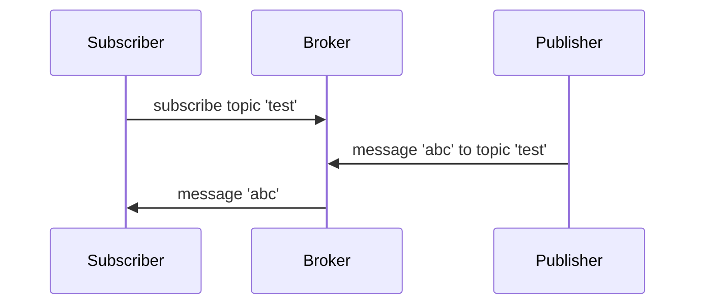
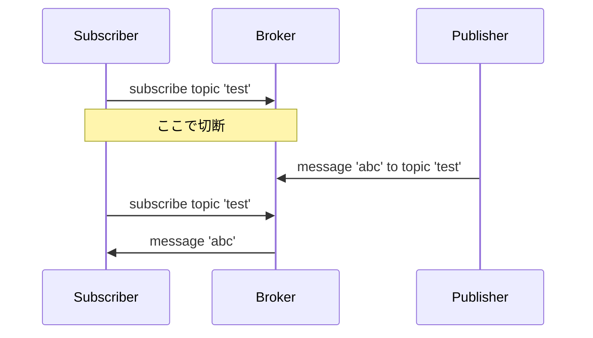
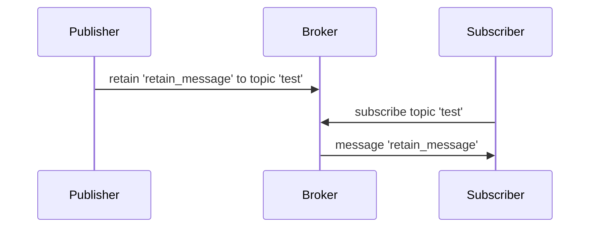
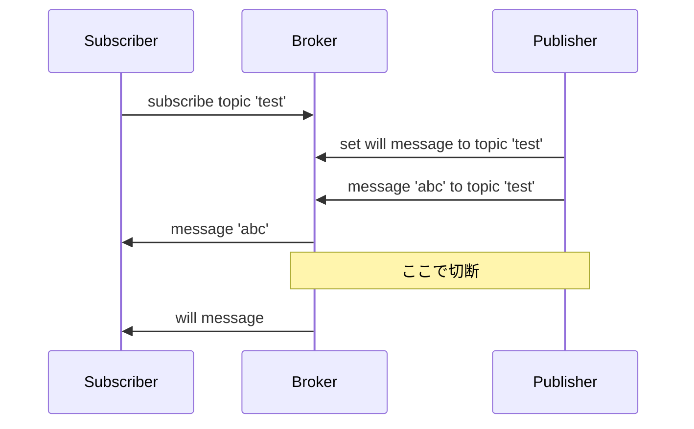

MQTTの基本動作をEclipse Foundationによるオープンソースのリファレンス実装であるMosquittoと、Python用のMQTTクライアントであるpaho-mqttを使って確認する。

- [Eclipse Mosquitto](https://mosquitto.org)
- [Eclipse Paho MQTT Python client library](https://pypi.org/project/paho-mqtt/)

## Broker

下記のようにBrokerを起動する。`-v`を指定すると詳細なログが表示される（verboseモード）。  
デフォルトでは、1883番ポートを使用する。

```bash
mosquitto -v
```

## PublishとSubscribe


Subscriberでtestトピックを購読（subscribe）する。

```bash
mosquitto_sub -t test
```

Publisherでtestトピックにabcと発行（publish）する。

```bash
mosquitto_pub -t test -m abc
```

Subscriberにabcと表示される。

## QoS

Subscriberは購読する際に、Publisherはメッセージを発行する際に、QoSを指定する。

- QoS 0（デフォルト）：メッセージを最高1回届ける（届かないこともある）
- QoS 1：メッセージを最低1回届ける（2回届くこともある）
- QoS 2：メッセージを必ず1回届ける

SubscriberとPublisherで指定したQoSが異なる場合は、低い方に設定される。

## Durable Subscribe



Subscriberが下記の条件で購読したとする。

- QoSを1または2
- クライアントIDをセットする
- Clean Sessionなし

```bash
mosquitto_sub -t test -q 1 -i client01 -c
```

その後、SubscriberがBrokerとの接続を切断する。

Publisherが、QoSを1または2としてメッセージを発行する。

```bash
mosquitto_pub -t test -m abc -i client02 -q 1
```

その時点ではメッセージはSubscriberに届かないが、Subscriberが再度同じ条件でBrokerに接続し、購読を始めた際に、Publisherが発行したメッセージが届く。  
Subscriberの切断時にメッセージが複数発行されていれば、そのメッセージはすべて再接続時に届く。

### Pythonでの実装

Subscriberの実装は下記のとおり。

```python
import paho.mqtt.client as mqtt

def on_message(client, userdata, message):
    print('topic:', message.topic)
    print('payload:', message.payload)
    print('qos:', message.qos)

client03 = mqtt.Client(client_id='client03', clean_session=False)
client03.on_message = on_message

client03.connect('localhost', 1883)
client03.subscribe(topic='test', qos=1)
client03.loop_forever()
```

Publisherの実装は下記のとおり。

```python
import paho.mqtt.client as mqtt

client04 = mqtt.Client(client_id='client04')

client04.connect('localhost', 1883)
info = client04.publish(topic='test', payload='abc', qos=1)
print('rc:', info.rc)
print('mid:', info.mid)
client04.disconnect()
```

## Retain



PublisherはあらかじめRetainメッセージをBrokerに登録しておくことによって、新たに購読を始めたSubscriberに対してそのメッセージを届けることができる。

既に購読しているSubscriberに対しては、Retainメッセージを登録した時点でそのメッセージが届く。

```bash
mosquitto_pub -t test -m retain -r
```

### Pythonでの実装

Publisherを下記のように実装する。

```python
import paho.mqtt.client as mqtt

client04 = mqtt.Client(client_id='client04')

client04.connect('localhost', 1883)
info = client04.publish(topic='test', payload='retain', retain=True)
print('rc:', info.rc)
print('mid:', info.mid)
client04.disconnect()
```

Subscriberでは特殊な実装は必要ない。クライアントIDやClean Sessionの設定も不要。  
Subscriberが受信済みのRetainメッセージは、同一IDで接続している限り、さらに届くことはない（QoS次第かも？）。

## Will



PublisherがあらかじめWillメッセージと、送信先のトピックを設定しておくと、PublisherとBrokerの接続が不意に切れた際に、トピックのSubscriberにWillメッセージが届く。

ここで「不意に切れた」とは、正常に`disconnect`が行われなかったという意味であり、下記のように`disconnect`が行われていればWillメッセージは送信されない。

```python
import paho.mqtt.client as mqtt

client04 = mqtt.Client(client_id='client04')
client04.will_set(topic='test', payload='will')

client04.connect('localhost', 1883)
info = client04.publish(topic='test', payload='abc')
print('rc:', info.rc)
print('mid:', info.mid)
client04.disconnect()
```

一方、下記のように`disconnect`を行うことなくPublisherのプロセスを終了させた場合、`keepalive`のデフォルト値である60秒が経過した時点でWillメッセージが送信される。

```python
import paho.mqtt.client as mqtt

client04 = mqtt.Client(client_id='client04')
client04.will_set(topic='test', payload='will')

client04.connect('localhost', 1883)
info = client04.publish(topic='test', payload='abc')
print('rc:', info.rc)
print('mid:', info.mid)
# diconnectしない
#client04.disconnect()
```

さらに、下記の例のように定期的にメッセージを発行しており（ここでは60秒）、Brokerへの接続時に`keepalive`を5分と設定していたとする。  
その場合でも、Publisherのプロセスを強制終了するなどして、Brokerが不意の切断を認識することができれば、`keepalive`の時間を待つことなくWillメッセージをSubscriberに送信する。

```python
import paho.mqtt.client as mqtt
from time import sleep

client04 = mqtt.Client(client_id='client04')
client04.will_set(topic='test', payload='will')

client04.connect('localhost', 1883, keepalive=300)

i = 1
while True:
    info = client04.publish(topic='test', payload='message %i' % i)
    print('rc:', info.rc)
    print('mid:', info.mid)
    i+=1
    sleep(60)
```

ところで、Publisherでメッセージを発行していなくても、`loop_forever`を実行していれば`keepalive`の間隔で行われたBrokerからPublisherに対する`PINGREQ`に、`PINGRESP`を返すことができる。接続は継続しているものとしてWillメッセージは送信されない。

```python
import paho.mqtt.client as mqtt

client04 = mqtt.Client(client_id='client04')
client04.will_set(topic='test', payload='will')

client04.connect('localhost', 1883)
info = client04.publish(topic='test', payload='abc')
print('rc:', info.rc)
print('mid:', info.mid)
client04.loop_forever()
```

