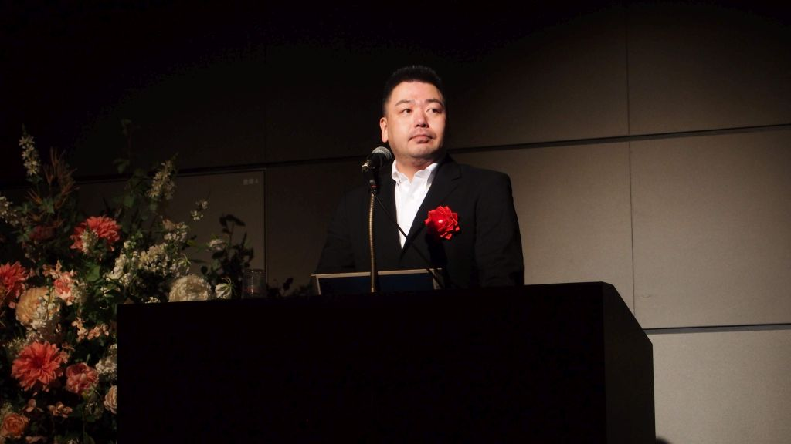

ITエンジニア／経済産業省推進資格ITコーディネータ。  
[株式会社ビビンコ](https://vivinko.com)代表取締役、[Tech Garden School](https://techgardenschool.com)講師。  
放送大学 大学院文化科学研究科に修士選科生として在籍中。  
福岡県北九州市出身。神奈川県横浜市在住。

20年を超える業務システムの開発経験の中で、コールセンターへのAI導入プロジェクトに参画したことをきっかけに、2016年に初の著書「初めてのWatson～APIの用例と実践プロラミング」を執筆。AI・IoTに強いITコーディネータとして活動するようになる。  
2017年には、北九州市主催のビジネスコンテスト「北九州でIoT」に応募したアイディアが入選。そのメンバーと株式会社ビビンコを北九州市小倉北区に創業し、IoTソリューションの開発・導入や、画像認識モデルを活用したアプリの開発などを行っている。

近著に「使って分かった AWSのAI」、「ワトソンで体感する人工知能」。  
日本全国でセミナー・研修講師としての登壇も多数。