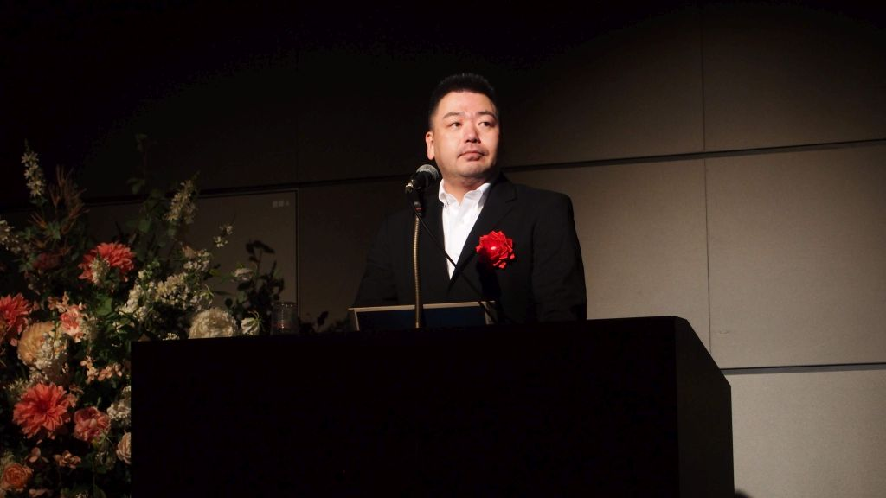

AI・IoTに強いITコーディネータとして、日本全国で登壇させていただいております。  
研修では初心者でも取り組めるAI・IoTの実習やグループワークを座学と組み合わせ、セミナーでもできるだけ実演を入れるなど「体感して肚に落ちる」ことがモットーです。  
リモートでの研修にも積極的に取り組んでおりますので、ぜひ[お問い合わせ](/contact)ください。

## 講師（研修等）

- [Tech Garden School](https://techgardenschool.com/) 講師
- ITコーディネータ協会主催研修[「ITCのための実践AI〜AIクラウド体験研修〜」](https://www.itc.or.jp/foritc/seminar/ai_cloud.html)
- ITコーディネータ協会主催研修[「ITCのための実践AI～AIプロジェクト実践研修～」](https://www.itc.or.jp/foritc/seminar/ai_jissen.html)
- ITコーディネータ協会主催研修[「ITコンサルタントのためのデータ分析体験研修」](https://www.itc.or.jp/foritc/seminar/ai_data.html)
- SEプラス主催研修（SEカレッジ）「Watsonで体感するAIプロジェクト入門」
- SEプラス主催研修（SEカレッジ）「Pythonで活用するIBM Watson」
- 山形県ICT実践人材育成協議会「AIクラウドサービス実践活用研修」
- 富山県総合情報センター「実践AI研修」
- 小学校・中学校・高等学校教職員対象 研修会「AI入門講座」、「AI講座（初級編・発展編）」
- 早稲田文理専門学校「AIビジネスの理論と実践」研修 ＜履修証明プログラム＞
- 沖縄県情報産業協会iTAP「ITコンサルタントのための実践AI」
- リックテレコム主催「コンタクトセンターのためのAI入門講座」
- リックテレコム主催「作ってわかるWatson ハンズオンセミナー」
- 日本テクノセンター主催「人工知能（コグニティブ・コンピューティング）Watsonの基礎とその活用法」
- こどもロボットプログラミングスクール 講師

## 登壇（セミナー等）

- ITコーディネータ協会主催「ITC Conference 2019」
- 東京都 令和元年度技術職員研修「AIの社会実装をどう進めるか」
- 北九州市産業経済局「RPA研修」
- 石川県情報化支援協会主催「IT経営カンファレンス2018 in 金沢」
- Innovation Leaders Summit 2017「IBM WatsonでInnovationを」
- その他、名古屋商工会議所 鯱の会 未来研究会、さっぽろ産業振興財団、宮崎市誘致企業連絡協議会主催セミナーなど