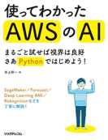
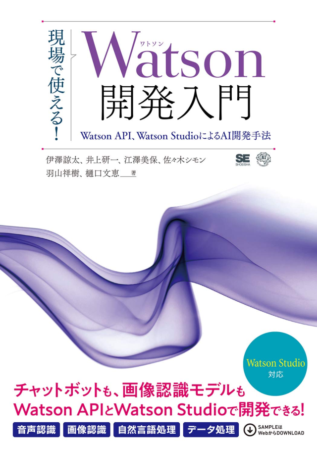
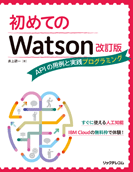
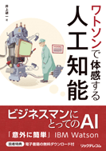
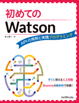
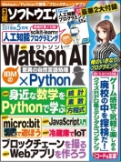
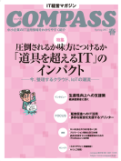

井上研一が執筆した書籍や雑誌記事などを紹介します。

- [Amazon.co.jp 著者ページ](https://www.amazon.co.jp/~/e/B01M0RV6DK)　※書籍を購入することができます
- [CiNii著者ページ](https://ci.nii.ac.jp/author/DA18799768)
- [国立国会図書館典拠データ](https://id.ndl.go.jp/auth/ndlna/001247287)
- [VIAF バーチャル国際典拠ファイル](http://viaf.org/viaf/171147965879084082542)

## 書籍

### 使ってわかったAWSのAI

井上研一 著　リックテレコム　2020年5月刊行  
本書は、AWSが提供するAIのサービスについて、その全体像をまるごとざっくりつかんで頂くことを目的としています。Pythonを使って、まずは画像認識の「Rekognition」や音声認識の「Transcribe」など、比較的身近なサービスを見ていきます。次に、トレーニングデータを準備して予測モデルを作成する「Forecast」や「Personalize」を操作してみます。AWS AIの世界はさらに広がります。本書の後半では、より一層高度なサービス、すなわち完全マネージド型の機械学習サービス「SageMaker」、深層学習フレームワーク「Deep LearningAMI」にチャレンジします。それでは、早速はじめましょう!  
[コードリスト](/docs/awsai/)

### 現場で使える！Watson開発入門

伊澤諒太、井上研一、江澤美保、佐々木シモン、羽山祥樹、樋口文恵 著　翔泳社　2019年3月刊行  
AIサービスの先駆けでもある「Watson（ワトソン）」。近年急激な進化を遂げています。機械学習や深層学習を利用したアプリケーション開発において利用する開発者の方も増加してきています。本書は、そうしたWatson の主力サービスである、Watson Assistant、Watson Discovery、Watson Studioを軸にした開発手法を紹介する書籍です。第1部では、Watson、Watson APIとIBM Cloudを利用したAIサービス開発の基本を紹介します。第2部では、「Watson Assistant」「Watson Discovery」「Watson Studio」を利用したAIサービスの開発手法を紹介。最終章では、ハタプロ社のロボット「ZUKKU（ズック）」の事例なども紹介します。  
※井上は第6章の「Watson Studioで機械学習を行う」を執筆しました。  
[出版社によるサポートサイト](https://www.shoeisha.co.jp/book/detail/9784798158495)

### 初めてのWatson 改訂版 ～APIの用例と実践プログラミング

井上研一 著　リックテレコム　2018年2月刊行   
本書は2016年11月に刊行された『初めてのWatson』の改訂版です。「Watsonとは何か？」からスタートし、IBM Cloudの無料枠を使って動かしたり、簡単なボットアプリや画像認識アプリを作ります。プログラマに限らず、JavaScriptが書ける方ならどなたでも、本書で手軽にWatsonを体験できます。改訂版ではDiscoveryやNLUなどの新しいAPI情報を盛り込みました。  
[出版社によるサポートサイト](http://www.ric.co.jp/book/contents/book_1128.html)

### ワトソンで体感する人工知能

井上研一 著　リックテレコム　2017年7月刊行  
本書はビジネスマンや文系の学生さん向けに、人工知能の全体像を簡潔かつ平易に解説。現在の技術で本当は何ができ、何ができないのかを、自分で見抜けるように導きます。さらにIBMのワトソンを無償枠で動かし、人工知能の働きを体感。「だったら会社のアレができるかも・・・」といったアイデアが触発されるかもしれません。  
[出版社によるサポートサイト](http://www.ric.co.jp/book/contents/book_1071.html)

### 初めてのWatson ～APIの用例と実践プログラミング

井上研一 著　リックテレコム　2016年10月刊行（販売終了）  
本書は「Watsonを使ってみたい」という方向けの解説書です。「Watsonとは何か？」からスタートし、クラウドサービスIBM Bluemixの無料枠を使ってWatsonを動かしたり、簡単なボットアプリや画像認識アプリを作ります。ITエンジニアに限らず、JavaScriptが書ける方なら、一般ビジネスマンや学生さんでも、余さず本書を活用できるでしょう。  
[出版社によるサポートサイト](http://www.ric.co.jp/book/contents/book_1052.html)

※本書は2017年10月に、[Onlybook社より韓国語版](https://www.onlybook.co.kr/entry/watson-ai)が刊行されています。

## 雑誌

### 日経ソフトウェア 2018年5月号

日経BP　2018年3月刊行  
特集「Watson AI × Pythonで自然言語分類」を執筆しました。  
[出版社によるサポートサイト](https://info.nikkeibp.co.jp/media/NSW/atcl/mag/062200016/)

### IT経営マガジンCOMPASS 2017年春号

リックテレコム　2017年2月刊行  
最新用語解説「AI（人工知能）」を執筆しました。  
[出版社によるサポートサイト](https://www.compass-it.jp/backnumber/2603)

## オンラインメディア

- 東洋経済オンライン [｢何となくAI ｣､実はアルゴリズム活用だった](https://toyokeizai.net/articles/-/286772)（2019年6月）
- GMOグループ Z.com ZLOG [井上研一先生コラム](https://hosting.z.com/jp/category/z-log/column/)（2017年1月～10月）
- @IT [OSS「JobScheduler」で実現するこれからの運用自動化](https://www.atmarkit.co.jp/ait/articles/1401/20/news140.html)（2014年1月）