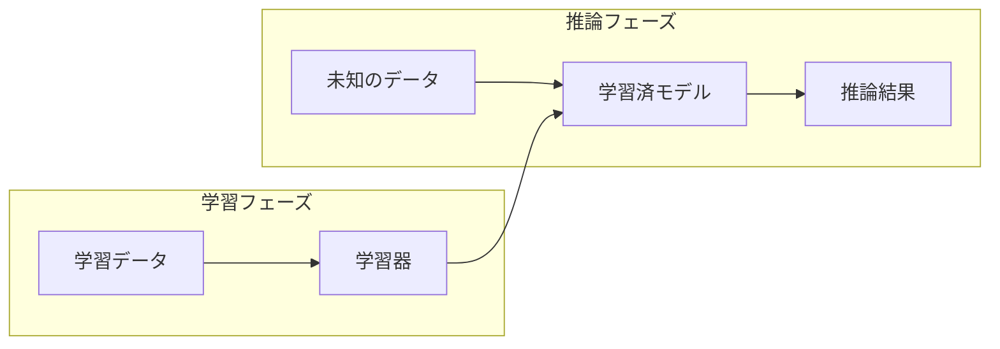

## with/afterコロナの 世界とAI

2020年5月22日

井上 研一

---

## 井上 研一

- ITエンジニア／ITコーディネータ
- 株式会社ビビンコ 代表取締役
    - ビジネスコンテスト「北九州でIoT」で入選、株式会社ビビンコ創業
    - 口腔画像認識モデルとアプリの開発
- 放送大学 大学院文化科学研究科
- 近著に「使ってわかった AWSのAI」「現場で使えるWatson開発入門（共著）」

---

## 新著紹介

<table>
<tr valign='top'>
<td>

</td>
<td>
<b>「使ってわかったAWSのAI」</b> 
井上研一・著 
リックテレコム・刊 
2020年5月26日発売
</td>
</tr>
</table>

---

## 新しい生活様式

- **「新しい生活様式」**（働き方の部分）
  - テレワーク、ローテーション勤務、時差通勤
  - 会議、名刺交換はオンラインで
  - 対面での打ち合わせは換気をマスク
- **「働き方改革」**
  - 働く人のニーズの多様化に応える
  - 就業機会の拡大
  - 意欲・能力を存分に発揮できる環境

---

## DXとAI/IoT

- **DX（総務省の定義）**
  - ICTの浸透が人々の生活をあらゆる面でより良い方向に変化させること

- **with/afterコロナにおけるDX**
  - いつでもどこでも労働生産性を損なわずに働ける
  - 人の「力技」に頼る時代からの卒業
	- AI/IoTによってITはよりリアルな場所へ

---

## いま起きていること
- テレワーク
- ソーシャルディスタンス
	- [MAMORIO](https://robotstart.info/2020/05/12/mamorio-covid-1.html)
- ビッグデータ
	- [人流データの解析](https://corporate-web.agoop.net/pdf/covid-19/agoop\_analysis\_coronavirus.pdf)

---

## AWSのAIでできること

- すぐに使えるAI
  - Rekognition（画像認識）
  - Comprehend（テキスト分析）
  - Transcribe（音声認識）、Polly（音声合成）
  - Forecast（予測）、Personalize（推薦）
- 自由＆パワフルに作るAI
  - SageMaker
  - EC2 DLAMI

---

## 分類と予測

<table>
<tr>
<th>分類</th>
<th>予測</th>
</tr>
<tr>
<td>
<ul>
<li>Rekognition</li>
<li>Comprehend</li>
</ul>

→現状の認識

</td>
<td>
<ul>
<li>Forecast</li>
<li>Personalize</li>
</ul>

→未来の予測

</td>
</tr>
</table>

---

## 学習と推論

---

## Rekognition

- 画像や動画の認識
  - モノやシーン
  - 顔、人物の追跡
  - テキスト
- 一部、カスタムモデル可能
- 人間の眼の代わりになるが、システムにどう組み込むか？

---

## Forecast

- 過去のデータから未来を予測（時系列）
  - 小売の需要予測
  - サプライチェーンの在庫予測
  - 収益・キャッシュフローの予測
- Web画面上でモデル作成・予測が可能

---

## with/afterコロナの世界とAI

- 人の眼で見ないと･･･という作業の代替
  - Rekognition、Comprehend
  - まずはIoTでデータ化、画像等はAIでデータ化

- 適切な資源配分（必要充分に最適化）
  - Forecast、Personalize
  - 必要なデータをきちんと取得することが前提

---

## 参考文献

- [碇　邦生（大分大学）【テレワークは前哨戦】アナログとデジタルで二分される世界](https://comemo.nikkei.com/n/nf55827b64eca)